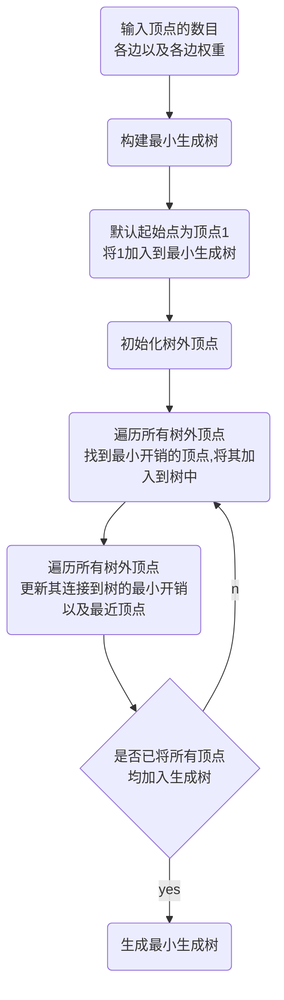

[toc]

# 1 分析

## 1.1 背景分析

这个项目的目标是构建一个小区电网，使得总工程造价最低。为了实现这个目标，我们需要使用一种名为最小生成树的算法。最小生成树算法的基本思想是：选择n个小区之间的n-1条边，使得这些边构成的图是一棵树，并且这些边的权值之和最小。为了使用最小生成树算法，我们需要首先建立一个图，其中每个节点表示一个小区，每条边表示两个小区之间的线路，边的权值表示建造线路的代价。然后我们可以使用最小生成树算法来求解这个问题，并计算出最小的总工程造价。

## 1.2 功能分析

为了实现本题求最小生成树，我首先需要实现一个图来储存电网的信息，然后定义一个电网类，具有构建图的点集图的边集等功能，然后还需要一个实现最小生成树的算法来求得最小生成树

# 2 设计

## 2.1 数据结构设计

本题需要存储图，且不涉及边的删除，考虑使用邻接矩阵的方式来存储图更加方便。邻接矩阵用一个关系矩阵来存储图中点与点之间的关系，矩阵大小为图的顶点个数，设顶点个数为 $n$，$m$用来表示邻接矩阵，$m[i,j]$ 表示矩阵中第$i$行第$j$列的值，则矩阵各元素的取值为
$$
m[i,j]=\left\{
\begin{aligned}
1   &     &{顶点i到顶点j有边}\\
0   &     &{顶点i到顶点j无边}
\end{aligned}
\right.
$$
用一个二维指针存储矩阵，以方便根据输入矩阵顶点的数目来确定矩阵大小，不浪费空间。

## 2.2 类结构设计

本题中首先需要一个邻接矩阵类储存图，其次需要一个prim算法类求出最小生成树，需要一个primNode类来储存prim算法所需要的节点相关信息，还需要一个电网类来完成最小生成树方法的调用还有用户交互。

## 2.3 操作设计

### 2.3.1 adjMatrix类设计

``` cpp
class adjMatrix
{
    public:
    adjMatrix(int vexMaxNum=VEX_MAX_NUM,int infinity=INFINITY);
    adjMatrix(char *vexs,int vexNum,int vexMaxNum=VEX_MAX_NUM,int infinity=INFINITY);
    void insertArc(int v1,int v2,int weight);
    ~adjMatrix();
    int getVexNum() const{return _vexNum;};
    int getArcNum() const{return _arcNum;};
    int firstAdjVex(int v);
    int nextAdjVex(int v,int w);
    int getWeight(int v1,int v2) const{return arcs[v1][v2];};
    int getInfinity() const{return _infinity;};
    int getPos(char v) const;
    char getName(int pos) const;
    char* getVertices() const{return vertices;};
    int** getArcs() const{return arcs;};
    friend ostream& operator<<(ostream& out,const adjMatrix& g);
    private:
    char *vertices;
    int _vexNum;
    int _vexMaxNum;
    int _arcNum;
    int _infinity;
    visitStatus* tag;
    int** arcs;
};
```

### 2.3.2 primNode类设计

``` cpp
//prim方法节点类定义
class primNode
{
	public:
	int lowCost;	//此节点到生成树的最小代价
	int nearVex;    //此节点到生成树的最小代价的相邻节点目录
};
```

### 2.3.3 prim算法类设计

``` cpp
class minSpanTreePrim
{
	public:
	static adjMatrix* getMinSpanTree(adjMatrix* net,int startVex)
	{
		int vexNum=net->getVexNum(),i,j,k;
		primNode *vexs;
		vexs=new primNode[vexNum];
		adjMatrix* minSpanTree=new adjMatrix(net->getVertices(),vexNum);
		vexs[startVex].lowCost=0;
		vexs[startVex].nearVex=-1;
		for(i=0;i<vexNum;i++)
			if(startVex!=i)
			{
				vexs[i].lowCost=net->getWeight(startVex,i);
				vexs[i].nearVex=startVex;
			}
		for(i=1;i<vexNum;i++)
		{
			int minWeight=net->getInfinity(),minOrder;
			for(j=0;j<vexNum;j++)
				if(vexs[j].lowCost!=0&&vexs[j].lowCost<minWeight)
				{
					minWeight=vexs[j].lowCost;
					minOrder=j;
				}
			if(minWeight==net->getInfinity())
			{
				cerr<<"the graph is not a connectivity graph, unable to generate a minimal spanning tree!"<<endl;
				delete minSpanTree;
				minSpanTree=nullptr;
				break;
			}
			else
			{
				vexs[minOrder].lowCost=0;
				minSpanTree->insertArc(vexs[minOrder].nearVex,minOrder,minWeight);
				for(k=net->firstAdjVex(minOrder);k!=-1;k=net->nextAdjVex(minOrder,k))
					if(vexs[k].lowCost!=0&&net->getWeight(minOrder,k)<vexs[k].lowCost)
					{
						vexs[k].lowCost=net->getWeight(minOrder,k);
						vexs[k].nearVex=minOrder;
					}
			}
		}
		delete[] vexs;
		return minSpanTree;
	}
};
```

### 2.3.4 powerGrid类设计

``` cpp
class powerGrid
{
	private:
	adjMatrix* net;
	adjMatrix* minSpanTree;
	public:
	powerGrid():net(nullptr),minSpanTree(nullptr){};
	~powerGrid();
	void buildVertex();
	void buildEdge();
	void buildMinSpanTree();
	void showMinSpanTree();
};
```

## 2.4 系统设计

首先main函数打印用户交互信息，然后用户选择不同的选项，逐步完成电网网络的构建，加入点和边，然后输入起始点，调用prim方法，生成最小生成树，用户可以选择打印最小生成树，然后系统就会打印最小生成树，用户可以选择退出或继续加边，更改起始点，重新生成最小生成树。

# 3 实现

## 3.1 邻接矩阵核心功能实现

### 3.1.1 插边功能实现

``` cpp
void adjMatrix::insertArc(int v1,int v2,int weight)
{
    int choice=0;
    if(arcs[v1][v2]!=_infinity)
    {
        cout<<"the arc already exists, do you want to modify the weight of it?(1 for Yes, 2 for No)"<<endl;
        while(1)
        {
            cout<<"please enter the number:";
            cin>>choice;
            if(cin.fail()||(choice!=1&&choice!=2))
            {
                cin.clear();
                cin.ignore(9999,'\n');
                cout<<"invalid input!!! input it again!!!"<<endl;
                continue;
            }
            else
                break;
        }
    }
    if(choice==0||choice==1)
    {
        arcs[v1][v2]=weight;
	    arcs[v2][v1]=weight;
        if(choice==0)
            _arcNum++;
    }
    else if(choice==2)
        return;
}
```

### 3.1.2 寻找相邻点功能实现

``` cpp
int adjMatrix::firstAdjVex(int v) // 寻找相邻点
{
    if (!(v < 0 || v >= _vexNum))
    {
        for (int i = 0; i < _vexNum; i++)
        {
            if (arcs[v][i] >= 0 && arcs[v][i] != _infinity)
                return i;
        }
    }
    return -1;
}

int adjMatrix::nextAdjVex(int v, int w) // 寻找相对w的相邻点
{
    if (v >= 0 && v < _vexNum && w >= 0 && w < _vexNum)
    {
        for (int i = w + 1; i < _vexNum; i++)
        {
            if (arcs[v][i] >= 0 && arcs[v][i] != _infinity)
                return i;
        }
    }
    return -1;
}
```

### 3.1.3 遍历图实现

``` cpp
for(i=0;i<_vexNum;i++)
{
    for(k=net->firstAdjVex(minOrder);k!=-1;k=net->nextAdjVex(minOrder,k)) 
                    //如果相邻节点且还没有加入最小生成树且与新加入生成树节点的代价小于原最小代价
					if(vexs[k].lowCost!=0&&net->getWeight(minOrder,k)<vexs[k].lowCost)    
					{
                        //更新树外顶点的连接到树的最小代价
						vexs[k].lowCost=net->getWeight(minOrder,k);   
                        //更新树外顶点连接到树的最近相邻树内顶点
						vexs[k].nearVex=minOrder;
					}
}
```

## 3.2 Prim算法实现

### 3.2.1 Prim算法思维导图



### 3.2.2 Prim算法实现

``` cpp
static adjMatrix* getMinSpanTree(adjMatrix* net,int startVex)
	{
		int vexNum=net->getVexNum(),i,j,k;
		primNode *vexs;
		vexs=new primNode[vexNum];
		adjMatrix* minSpanTree=new adjMatrix(net->getVertices(),vexNum);
		vexs[startVex].lowCost=0;
		vexs[startVex].nearVex=-1;
		for(i=0;i<vexNum;i++)
			if(startVex!=i)
			{
				vexs[i].lowCost=net->getWeight(startVex,i);
				vexs[i].nearVex=startVex;
			}
		for(i=1;i<vexNum;i++)
		{
			int minWeight=net->getInfinity(),minOrder;
			for(j=0;j<vexNum;j++)
				if(vexs[j].lowCost!=0&&vexs[j].lowCost<minWeight)
				{
					minWeight=vexs[j].lowCost;
					minOrder=j;
				}
			if(minWeight==net->getInfinity())
			{
				cerr<<"the graph is not a connectivity graph, unable to generate a minimal spanning tree!"<<endl;
				delete minSpanTree;
				minSpanTree=nullptr;
				break;
			}
			else
			{
				vexs[minOrder].lowCost=0;
				minSpanTree->insertArc(vexs[minOrder].nearVex,minOrder,minWeight);
				for(k=net->firstAdjVex(minOrder);k!=-1;k=net->nextAdjVex(minOrder,k))
					if(vexs[k].lowCost!=0&&net->getWeight(minOrder,k)<vexs[k].lowCost)
					{
						vexs[k].lowCost=net->getWeight(minOrder,k);
						vexs[k].nearVex=minOrder;
					}
			}
		}
		delete[] vexs;
		return minSpanTree;
	}
```

## 3.3 用户交互实现

### 3.3.1 输入点功能实现

``` cpp
void powerGrid::buildVertex()
{
	if(net==nullptr)
	{
		int n;
		while (1)
		{
			cout << "请输入顶点的个数：";
			cin >> n;
			if (cin.fail() || n <= 0)
			{
				cin.clear();
				cin.ignore(99999, '\n');
				cout << "error" << endl;
			}
			else
				break;
		}
		cout << "请依次输入各顶点的名称：" << endl;
		char vexs[VEX_MAX_NUM];
		vexs[n]='\0';
		for (int i = 0; i < n; i++)
			cin >> vexs[i];
		cin.ignore(9999, '\n');
		net=new adjMatrix(vexs,n);
	}
	else
		cerr<<"the powerGrid's vertices have already been created, do not create it again"<<endl;
}
```

### 3.3.2 输入边功能实现

``` cpp
void powerGrid::buildEdge()
{
	while (1)
    {
		char v1,v2;
		int weight;
        cout << "请输入两个顶点及边：";
        cin >> v1 >> v2>>weight;
        if (v1 == '?' || v2 == '?' || weight == 0)
        {
            cin.ignore(9999, '\n');
            break;
        }
        else if (cin.fail() || weight < 0||v1==v2)
        {
            cerr << "invalid input!!!\nplease input again!!!" << endl;
            cin.ignore(99999, '\n');
            continue;
        }
        else
		{
			int pos1=net->getPos(v1);
			int pos2=net->getPos(v2);
			if(pos1==-1||pos2==-1)
			{
				if(pos1==-1)
					cerr<<"there is no vertex called "<<v1<<endl;
				if(pos2==-1)
					cerr<<"there is no vertex called "<<v2<<endl;
				cerr<<"please input again!"<<endl;
				continue;
			}
			net->insertArc(pos1,pos2,weight);
		}
    }
}
```

### 3.3.3 展示最小生成树功能实现

``` cpp
void powerGrid::showMinSpanTree()
{
	if(minSpanTree!=nullptr)
	{
		char* vexs=minSpanTree->getVertices();
		int** arcs=minSpanTree->getArcs();
		int vexNum=minSpanTree->getVexNum();
		cout<<"最小生成树各个顶点以及与其相邻的边如下："<<endl;
		for(int i=0;i<vexNum;i++)
		{
			char v=minSpanTree->getName(i);
			cout<<"顶点："<<v<<'\t';
			for(int j=0;j<vexNum;j++)
			{
				if(arcs[i][j]!=minSpanTree->getInfinity())
					cout<<v<<"-<"<<arcs[i][j]<<">-"<<minSpanTree->getName(j)<<'\t';
			}
			cout<<endl;
		}
	}
	else
		cerr<<"the minSpanTree hasn't been generated yet"<<endl;
}
```

# 4 测试

## 4.1 正常测试


## 4.2 错误测试

### 4.2.1 顶点个数输入错误


### 4.2.2 插入边时该边两顶点间已有边

预期结果：给出提示并询问是否需要更改边的值


### 4.2.3 插入边时顶点不存在

预期结果：给出提示并重新输入


### 4.2.4 图不连通生成最小生成树

预期结果：给出图不连通的提示，并继续选择操作


### 4.2.5 未生成最小生成树就要显示最小生成树

预期结果：给出提示并重新选择


### 4.2.6 生成最小生成树后继续加点

预期结果：给出提示无法继续添加点，继续选择

