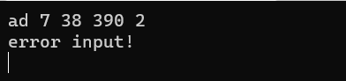
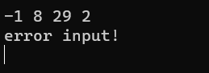
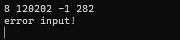

# 1 分析

## 1.1 背景分析

农夫要修理牧场的一段栅栏，他测量了栅栏，发现需要N块木头，每块木头长度为整数*Li*个长度单位，于是他购买了一个很长的，能锯成N块的木头，即该木头的长度是$L_i$的总和。但是农夫自己没有锯子，请人锯木的酬金跟这段木头的长度成正比。为简单起见，不妨就设酬金等于所锯木头的长度。例如，要将长度为20的木头锯成长度为8，7和5的三段，第一次锯木头将木头锯成12和8，花费20；第二次锯木头将长度为12的木头锯成7和5花费12，总花费32元。如果第一次将木头锯成15和5，则第二次将木头锯成7和8，那么总的花费是35（大于32）。现在要求所求酬金最少，为此设计了一个程序给出最少的酬金为多少。

## 1.2 功能分析

本题需要一个输入函数来输入需要把木头锯成的块数N和每块的长度，同时需要一个函数来计算最少的酬金为多少，最后将最少酬金输出。

# 2 设计

## 2.1 数据结构设计

本题正向思考比较困难，不如反向思考，比如要将一块长度20的木头锯成长度为8，7和5的三段，可以先选择5和7两段，由长度为12的木头锯成，此时价格为12，而剩下木块便是12和8，需要的价格为20，总花费便是20+12=32元。反向思考，每次选取长度最短的两个木块，考虑使用优先级队列实现，越小的数优先级越高。

## 2.2 类结构设计

### 2.2.1 Vector模板类

使用一段连续空间存储数据，具有增删改查等功能，先指定一个最大容量，若后续加入数据，容量不够则扩充容量。

### 2.2.2 priorityQueue模板类

使用最小堆实现，对于一个节点，满足其值小于其孩子节点的值，每次插入弹出元素时都对这种性质进行维护，使得每次弹出的元素都是序列中最小的元素，元素使用Vector储存，通过下标给每个节点指定父亲节点以实现树的性质。

## 2.3 操作设计

### 2.2.1 Vector模板类

``` cpp
template <class T>
class Vector
{
private:
    T* elements = nullptr;
    int maxSize = 0;
    int length = maxSize;
    void setMaxSize(int size) { maxSize = size; };
    void overSize();

public:
    Vector() : maxSize(0), length(0), elements(nullptr) {};
    Vector(int size) : maxSize(size), length(size)
    {
        if (size > 0)
        {
            elements = new T[size];
            if (!elements)
                std::cerr << "wrong memeory allocation!\n";
        }
        else
            elements = nullptr;
    };
    Vector(int size, T elem) : maxSize(size), length(size)
    {
        if (size > 0)
        {
            elements = new T[size];
            if (!elements)
                std::cerr << "wrong memeory allocation!\n";
            for (int i = 0; i < size; i++)
                elements[i] = elem;
        }
        else
            elements = nullptr;
    };
    Vector(const Vector<T>& v) : elements(v.elements), maxSize(v.maxSize), length(v.length) {};
    ~Vector() { delete[] elements; };
    void pushBack(const T& elem);
    int getLength() const { return length; };
    void insert(int i, const T& elem);
    T remove(int i);
    void reMove(const T& aim);
    T minElem();
    T maxElem();
    T& operator[](int i) const;
    int find(const T& elem) const;
    T sum();
    void makeEmpty();
};
```

### 2.3.2 priorityQueue模板类

``` cpp
template <class T>
class priorityQueue
{
private:
    int size;				// the size of the queue
    Vector<T> heap;			// to store the data
    void filterUp(int i);	// to maintain the minHeap from bottle to top
    void filterDown(int i); // to maintain the minHeap from top to bottle
    T popMin();				// pop the minimal elem
    int parent(int i);		// return the position of parent
    int left(int i);		// return the position of left child
    int right(int i);		// return the posision of right child
    void swap(T& a, T& b);	// swap the value of a,b
public:
    priorityQueue();
    ~priorityQueue();
    bool empty();	   // judge whether the queue is empty
    T pop();		   // out of the queue
    void push(T elem); // into the queue
};
```

## 2.4 系统设计

本题首先通过input()函数输入需要分割的块数以及每块的长度，然后将每块的长度push进优先级队列中，然后调用minPrice()函数计算出最小酬金。

# 3 实现

## 3.1 最小堆性质维护实现

每次向最小堆中插入时，在序列尾部插入然后自底向上调整维护最小堆性质，弹出时弹出序列第一位，然后将序列最后一位元素填充至首位，再自顶向下调整维护堆的性质。

``` cpp
//自底向上调整
template <class T>
void priorityQueue<T>::filterUp(int i)
{
    if (heap.getLength())
    {
        int k = size - 1;
        int j = parent(k);
        T temp = heap[k];
        while (k > i)
        {
            if (heap[k] >= heap[j])
                break;
            else
            {
                heap[k] = heap[j];
                k = j;
                j = parent(j);
            }
            heap[k] = temp;
        }
    }
}

//自顶向下调整
template <class T>
inline void priorityQueue<T>::filterDown(int i)
{
    if (heap.getLength())
    {
        int j = left(i);
        T temp = heap[i];
        while (j <= size - 1)
        {
            if (j < size - 1 && heap[j] > heap[j + 1])
                j++;
            if (temp <= heap[j])
                break;
            else
            {
                heap[i] = heap[j];
                i = j;
                j = 2 * j + 1;
            }
            heap[i] = temp;
        }
    }
}
```

## 3.2 计算最小酬金实现

``` cpp
int minPrice(priorityQueue<int>& lengths)
{
    int price = 0;
    while (!lengths.empty() && lengths.getLength() != 1)
    {
        int min1 = lengths.pop();        //每次弹出最小的木块长度
        price += min1;
        int min2 = lengths.pop();
        price += min2;
        lengths.push(min1 + min2);       //将其总和压入队列
    }
    return price;
}
```

# 4 测试

## 4.1 正确输入测试


经过测验满足最小酬金的要求，符合题意。

## 4.2 错误输入测试

### 4.2.1 输入非法字符



### 4.2.2 输入数据超出范围





