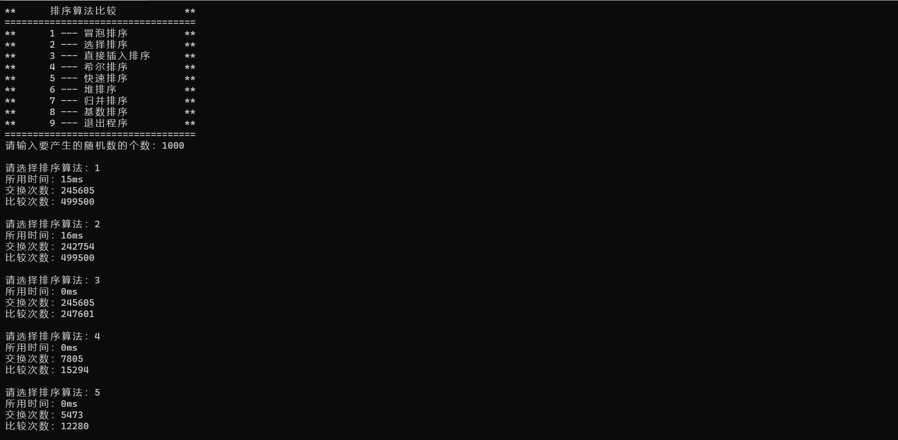

# 1 分析

## 1.1 背景分析

排序算法在生活中有很多的应用。例如，当你想要按字母顺序排列一个列表时，你可以使用排序算法。在超市里，商品也是按照一定顺序排列的，这也是使用了排序算法的一个例子。在数据库中，排序算法也经常被用来对数据进行排序，以便更快地查找特定的信息。总之，排序算法是一种非常有用的工具，它可以让我们对数据进行有序的处理。本项目要实现经典的八种排序算法，并对其进行比较。

## 1.2 功能分析

本题首先要实现八种排序算法，这八种排序算法分别是冒泡排序，选择排序，直接插入排序，希尔排序，快速排序，堆排序，归并排序和基数排序。然后要能够得到其运算的时间以及统计每种排序算法的比较次数与交换次数。提供一个生成指定数量随机数的函数，同时要提供一个程序入口来实现对八种排序算法的选择。

# 2设计

## 2.1 数据结构设计

本题中用数组存储需要排序的元素，故定义一个Vector模板类来存储待排序的元素，然后堆排序中需要用到堆来实现，故还构造了一个优先级队列模板类，通过最小堆来完成堆排序。

## 2.2 类结构设计

本题构造了一个排序算法类，用以给出八种排序算法以及随机数的生成。排序算法类中有两个Vector对象，一个是用来生成随机数，零一个每次排序前将随机数序列拷贝过来进行排序。

## 2.3 操作设计

### 2.3.1 Vector模板类设计

``` cpp
template <class T>
class Vector
{
private:
    T* elements = nullptr;
    int maxSize = 0;
    int length = maxSize;
    void setMaxSize(int size) { maxSize = size; };
    void overSize();

public:
    Vector() : maxSize(0), length(0), elements(nullptr) {};
    Vector(int size) : maxSize(size), length(size)
    {
        if (size > 0)
        {
            elements = new T[size];
            if (!elements)
                std::cerr << "wrong memeory allocation!\n";
        }
        else
            elements = nullptr;
    };
    Vector(int size, T elem) : maxSize(size), length(size)
    {
        if (size > 0)
        {
            elements = new T[size];
            if (!elements)
                std::cerr << "wrong memeory allocation!\n";
            for (int i = 0; i < size; i++)
                elements[i] = elem;
        }
        else
            elements = nullptr;
    };
    Vector(const Vector<T>& v) : elements(v.elements), maxSize(v.maxSize), length(v.length) {};
    ~Vector() { delete[] elements; };
    void pushBack(const T& elem);
    int getLength() const { return length; };
    void insert(int i, const T& elem);
    T remove(int i);
    void reMove(const T& aim);
    T minElem();
    T maxElem();
    T& operator[](int i) const;
    int find(const T& elem) const;
    T sum();
    void makeEmpty();
};
```

### 2.3.2 优先级队列模板类设计

``` cpp
template <class T>
class priorityQueue
{
private:
    int size;               // the size of the queue
    Vector<T> heap;         // to store the data
    void filterUp(int i);   // to maintain the minHeap from bottle to top
    void filterDown(int i); // to maintain the minHeap from top to bottle
    T popMin();             // pop the minimal elem
    T popMinByPtr();
    int parent(int i);          // return the position of parent
    int left(int i);            // return the position of left child
    int right(int i);           // return the posision of right child
    void swap(T &a, T &b);      // swap the value of a,b
    long long compareTimes = 0; // compare times
    long long swapTimes = 0;    // swap times

public:
    priorityQueue();
    ~priorityQueue();
    bool empty();      // judge whether the queue is empty
    T pop();           // out of the queue
    void push(T elem); // into the queue
    long long getCompareTimes() const
    {
        return compareTimes;
    };
    long long getSwapTimes() const
    {
        return swapTimes;
    };
};
```

### 2.3.3 排序算法类设计

``` cpp
class Sort
{
public:
    // 八种排序算法
    void bubbleSort(long long &compareTimes, long long &swapTimes);
    void selectionSort(long long &compareTimes, long long &swapTimes);
    void heapSort(long long &compareTimes, long long &swapTimes);
    void mergeSort(int low, int high, long long &compareTimes, long long &swapTimes);
    void quickSort(int low, int high, long long &compareTimes, long long &swapTimes);
    void straightInsertionSort(long long &compareTimes, long long &swapTimes);
    void shellSort(long long &compareTimes, long long &swapTimes);
    void radixSort(long long &compareTimes, long long &swapTimes);
    // 合并数组
    void mergeArray(int low, int mid, int high, long long &compareTimes, long long &swapTimes);
    // 生成随机数
    void generateRandomnumbers(int size);
    // 将乱序数组_array复制到array中
    void copyArray();
    Vector<unsigned int> _array;
    Vector<unsigned int> array;
};
```

## 2.4 系统设计

本题中，首先打印用户交互信息，然后用户选择生成随机数的数量，再选择需要使用的排序算法，给出选择排序算法的比较次数与交换次数和算法运行时间。等待用户继续选择排序算法或是退出程序。

# 3 实现

## 3.1 堆性质维护实现

### 3.1.1 自上往下调整堆的性质

``` cpp
template <class T>
inline void priorityQueue<T>::filterDown(int i)
{
    if (heap.getLength())
    {
        int j = left(i);
        T temp = heap[i];
        while (j <= size - 1)
        {
            compareTimes++;
            if (j < size - 1 && heap[j] > heap[j + 1])
                j++;
            compareTimes++;
            if (temp <= heap[j])
                break;
            else
            {
                swapTimes++;
                heap[i] = heap[j];
                i = j;
                j = 2 * j + 1;
            }
            heap[i] = temp;
        }
    }
}
```

### 3.1.2 从下往上调整堆的算法

``` cpp
template <class T>
void priorityQueue<T>::filterUp(int i)
{
    if (heap.getLength())
    {
        int k = size - 1;
        int j = parent(k);
        T temp = heap[k];
        while (k > i)
        {
            compareTimes++;
            if (heap[k] >= heap[j])
                break;
            else
            {
                swapTimes++;
                heap[k] = heap[j];
                k = j;
                j = parent(j);
            }
            heap[k] = temp;
        }
    }
}
```

## 3.2 八种排序算法实现

### 3.2.1 冒泡排序

冒泡排序是一种简单的排序算法。它重复地走访过要排序的数列，一次比较两个元素，如果它们的顺序错误就把它们交换过来。走访数列的工作是重复地进行直到没有再需要交换，也就是说该数列已经排序完成。这个算法的名字由来是因为越小的元素会经由交换慢慢“浮”到数列的顶端。

冒泡排序算法的运作如下：

1. 比较相邻的元素。如果第一个比第二个大，就交换它们两个；
2. 对每一对相邻元素作同样的工作，从开始第一对到结尾的最后一对，这样在最后的元素应该会是最大的数；
3. 针对所有的元素重复以上的步骤，除了最后一个；
4. 重复步骤1~3，直到排序完成。

冒泡排序算法的时间复杂度为O(n^2)，它是一种稳定的排序算法。

``` cpp
void Sort::bubbleSort(long long &compareTimes, long long &swapTimes)
{
    for (int i = 0; i < array.getLength(); i++) // 外层循环，循环array.getLength()次
    {
        for (int j = 0; j < array.getLength() - i - 1; j++) // 内层循环，循环array.getLength() - i - 1次
        {
            compareTimes++;              // 使compareTimes的值增加1
            if (array[j] > array[j + 1]) // 如果array[j]大于array[j + 1]
            {
                swapTimes++; // 使swapTimes的值增加1
                // 交换他们的值
                unsigned int temp = array[j]; // 将array[j]的值赋给临时变量temp
                array[j] = array[j + 1];      // 将array[j + 1]的值赋给array[j]
                array[j + 1] = temp;          // 将temp的值赋给array[j + 1]
            }
        }
    }
}
```

### 3.2.2 选择排序

选择排序是一种简单的排序算法。它的工作原理是每一次从待排序的数据元素中选出最小（或最大）的一个元素，存放在序列的起始位置，直到全部待排序的数据元素排完。选择排序是不稳定的排序方法（比如序列$[5， 5， 3]$第一次就将第一个[5]与[3]交换，导致第一个5挪动到第二个5后面）。

选择排序的时间复杂度为$O(n^2)$，它的优化方法是二元选择排序，该算法可以在每趟排序中选出两个关键字的最大值和最小值，且可以保证算法的稳定性。

``` cpp
void Sort::selectionSort(long long &compareTimes, long long &swapTimes)
{
    for (int i = 0; i < array.getLength() - 1; i++) // 外层循环，循环array.getLength() - 1次
    {
        int min = array[i];
        for (int j = i + 1; j < array.getLength(); j++) // 内层循环，循环array.getLength() - i - 1次
        {
            compareTimes++;     // 使compareTimes的值增加1
            if (array[j] < min) // 如果array[j]小于min
            {
                // 找到最小值
                swapTimes++;                  // 使swapTimes的值增加1
                unsigned int temp = array[j]; // 将array[j]的值赋给临时变量temp
                array[j] = min;               // 将min的值赋给array[j]
                min = temp;                   // 将temp的值赋给min
            }
        }
    }
}
```

### 3.2.3 直接插入排序

直接插入排序是一种简单直观的排序算法。它的工作原理是通过构建有序序列，对于未排序数据，在已排序序列中从后向前扫描，找到相应位置并插入。

算法步骤如下：

1. 从第一个元素开始，该元素可以认为已经被排序
2. 取出下一个元素，在已经排序的元素序列中从后向前扫描
3. 如果该元素（已排序）大于新元素，将该元素移到下一位置
4. 重复步骤3，直到找到已排序的元素小于或者等于新元素的位置
5. 将新元素插入到该位置后
6. 重复步骤2~5

``` cpp
void Sort::straightInsertionSort(long long &compareTimes, long long &swapTimes)
{
    unsigned int temp;
    int j;
    for (int i = 1; i < array.getLength(); i++)
    {
        compareTimes++;
        if (array[i] < array[i - 1])
        {
            temp = array[i];
            j = i - 1;
            while (1)
            {
                compareTimes++;
                if (temp >= array[j] || j < 0)
                    break;
                swapTimes++;
                array[j + 1] = array[j];
                j--;
            }
            array[j + 1] = temp;
        }
    }
}
```

### 3.2.4 希尔排序

希尔排序是插入排序的一种更高效的改进版本。它与插入排序的不同之处在于，它会优先比较距离较远的元素。希尔排序又叫缩小增量排序。

算法步骤如下：

1. 选择一个增量序列$t_1, t_2, \cdots, t_k$，其中$t_i>0$，$t_k=1$
2. 按增量序列个数$k$，对序列进行$k$趟排序
3. 每趟排序，根据对应的增量$t_i$，将待排序列分割成若干个子序列，分别进行插入排序。仅增量因子为1时，整个序列作为一个表来处理，表长度即为整个序列的长度

希尔排序是一种不稳定的排序方法，由于增量的存在，他会发生远距离交换，所以是一种不稳定的排序方法。本题中我的增量gap首先取数组长度的一半，然后逐次减半，直到为1。

``` cpp
void Sort::shellSort(long long &compareTimes, long long &swapTimes)
{
    int n = array.getLength(); // 获取数组的长度
    int gap = n;               // 初始化增量序列
    while (gap > 1)            // 当增量序列的值大于1时循环
    {
        gap = gap / 2;                    // 每次将增量序列除以2
        for (int i = 0; i < n - gap; i++) // 从0到n - gap循环
        {
            int end = i;                 // end初始化为i
            int temp = array[end + gap]; // 将array[end + gap]赋值给临时变量temp
            while (end >= 0)             // 如果end >= 0，继续循环
            {
                compareTimes++;        // 比较次数加1
                if (temp < array[end]) // 如果temp < array[end]
                {
                    swapTimes++;                   // 交换次数加1
                    array[end + gap] = array[end]; // 交换array[end + gap]和array[end]
                    end -= gap;                    // end减去gap
                }
                else       // 否则
                    break; // 退出循环
            }
            array[end + gap] = temp; // 将临时变量temp赋值给array[end + gap]
        }
    }
}
```

### 3.2.5 快速排序

快速排序是一种高效的排序算法，它的时间复杂度为$O(n\log n)$。快速排序的基本思想是分治法，通过一趟排序将待排序记录分隔成独立的两部分，其中一部分记录的关键字均比另一部分的关键字小，则可分别对这两部分记录继续进行排序，以达到整个序列有序的目的。快速排序是一种不稳定的排序算法。

算法步骤如下：

1. 从数列中挑出一个元素，称为"基准"（pivot），
2. 重新排序数列，所有元素比基准值小的摆放在基准前面，所有元素比基准值大的摆在基准的后面（相同的数可以到任一边）。在这个分区退出之后，该基准就处于数列的中间位置。这个称为分区（partition）操作。
3. 递归地把小于基准值元素的子数列和大于基准值元素的子数列排序

``` cpp
void Sort::quickSort(int low, int high, long long &compareTimes, long long &swapTimes)
{
    if (low >= high)
        return;
    int i = low;
    int j = high;
    int key = array[low];    //以low值下标为基准
    while (i < j)
    {
        for (; array[j] >= key && i < j; compareTimes++)
            j--;
        swapTimes++;
        array[i] = array[j];
        for (; array[i] <= key && i < j; compareTimes++)
            i++;
        swapTimes++;
        array[j] = array[i];
    }
    swapTimes++;
    array[i] = key;
    quickSort(low, i - 1, compareTimes, swapTimes);
    quickSort(i + 1, high, compareTimes, swapTimes);
}
```

### 3.2.6 堆排序

堆排序是一种树形选择排序，是对直接选择排序的有效改进。本题中我使用最小堆来实现堆排序，每次从堆中出来的都是最小值，从而完成排序。

``` cpp

void Sort::heapSort(long long &compareTimes, long long &swapTimes)
{
    priorityQueue<unsigned int> s;
    for (int i = 0; i < array.getLength(); i++)
    {
        s.push(array[i]);
    }
    for (int i = 0; i < array.getLength(); i++)
    {
        array[i] = s.pop();
    }
    compareTimes = s.getCompareTimes();
    swapTimes = s.getSwapTimes();
}
```

### 3.2.7 归并排序

归并排序是建立在归并操作上的一种有效的排序算法。该算法是采用分治法（Divide and Conquer）的一个非常典型的应用。将已有序的子序列合并，得到完全有序的序列；即先使每个子序列有序，再使子序列段间有序。若将两个有序表合并成一个有序表，称为二路归并。

算法步骤如下：

1. 申请空间，使其大小为两个已经排序序列之和，该空间用来存放合并后的序列
2. 设定两个指针，最初位置分别为两个已经排序序列的起始位置
3. 比较两个指针所指向的元素，选择相对小的元素放入到合并空间，并移动指针到下一位置
4. 重复步骤3直到某一指针达到序列尾
5. 将另一序列剩下的所有元素直接复制到合并序列尾

``` cpp
void Sort::mergeSort(int low, int high, long long &compareTimes, long long &swapTimes)
{
    if (low < high)
    {
        int mid = (low + high) / 2;
        mergeSort(low, mid, compareTimes, swapTimes);
        mergeSort(mid + 1, high, compareTimes, swapTimes);
        mergeArray(low, mid, high, compareTimes, swapTimes);
    }
}

void Sort::mergeArray(int low, int mid, int high, long long &compareTimes, long long &swapTimes)
{
    int *tmp = (int *)malloc(sizeof(int) * array.getLength());
    if (low >= high)
        return;
    else
    {
        int i = low, j = mid + 1, k = low;
        while (i <= mid && j <= high)
        {
            compareTimes++;
            if (array[i] <= array[j])
                tmp[k++] = array[i++];
            else
                tmp[k++] = array[j++];
        }
        while (i <= mid)
            tmp[k++] = array[i++];
        while (j <= high)
            tmp[k++] = array[j++];
        for (int i = low; i <= high; i++)
            array[i] = tmp[i];
        free(tmp);
    }
}
```

### 3.2.8 基数排序

基数排序（radix sort）是一种非比较型整数排序算法,是桶排序的一种，其原理是将整数按位数切割成不同的数字，然后按每个位数分别比较。基数排序的优点是，当位数相同时，基数排序的效率是线性对数级别的，比直接插入排序快得多，而且常数较小，比快速排序和归并排序的常数要小。

算法步骤如下：

1. 取得数组中的最大数，并取得位数；
2. arr为原始数组，从最低位开始取每个位组成radix数组；
3. 对radix进行计数排序（利用计数排序适用于小范围数的特点）；

``` cpp
void Sort::radixSort(long long &compareTimes, long long &swapTimes)
{
    int max = array[0];
    int base = 1;
    int n = array.getLength();

    for (int i = 0; i < n; i++)
    {
        compareTimes++;
        if (array[i] > max)
            max = array[i]; // 取得数组中的最大数
    }

    int *tmp = (int *)malloc(sizeof(int) * n);

    while (max / base > 0)
    {
        int bucket[10] = {0};
        for (int i = 0; i < n; i++)
            bucket[array[i] / base % 10]++;

        for (int i = 1; i < 10; i++)
            bucket[i] += bucket[i - 1];

        for (int i = n - 1; i >= 0; i--)
        {
            tmp[bucket[array[i] / base % 10] - 1] = array[i];
            bucket[array[i] / base % 10]--;
        }
        for (int i = 0; i < n; i++)
            array[i] = tmp[i];
        base *= 10;
    }
    free(tmp);
}
```

# 4 测试

## 4.1 正常情况测试

### 4.1.1 一百个随机数情况


### 4.1.2 一千个随机数情况




### 4.1.3 一万个随机数情况


### 4.1.4 十万个随机数情况


## 4.2 输入错误情况测试

### 4.2.1 随机数个数输入错误


### 4.2.2 算法选择错误


# 5 总结

下面是这些排序算法的复杂度表格：

| 排序算法 | 最优时间复杂度 | 最坏时间复杂度 | 平均时间复杂度 |
| -------- | -------------- | -------------- | -------------- |
| 冒泡排序 | $O(n)$         | $O(n^2)$       | $O(n^2)$       |
| 选择排序 | $O(n^2)$       | $O(n^2)$       | $O(n^2)$       |
| 插入排序 | $O(n)$         | $O(n^2)$       | $O(n^2)$       |
| 希尔排序 | $O(n\log n)$   | $O(n^2)$       | $O(n^s)$       |
| 快速排序 | $O(n\log n)$   | $O(n^2)$       | $O(n\log n)$   |
| 堆排序   | $O(n\log n)$   | $O(n\log n)$   | $O(n\log n)$   |
| 归并排序 | $O(n\log n)$   | $O(n\log n)$   | $O(n\log n)$   |
| 基数排序 | $O(nk)$        | $O(nk)$        | $O(nk)$        |

从上表可以看出，冒泡排序、选择排序和插入排序的时间复杂度都为$O(n^2)$，因此它们在处理大数据量的情况下效率较低。希尔排序的时间复杂度为$O(n^s)$，其中s是希尔排序中所使用的步长，它一般取值为1.3，因此希尔排序的时间复杂度约为$O(n^{1.3})$。

快速排序、堆排序和归并排序的时间复杂度都为$O(n\log n)$，因此它们的效率都非常高。其中，快速排序在最坏情况下的时间复杂度可能会升到$O(n^2)$，但它的平均时间复杂度仍然为$O(n\log n)$，因此快速排序在处理大数据量时仍然是一个非常高效的排序算法。

基数排序的时间复杂度为$O(nk)$，这意味着它可以在较短的时间内对大数据量进行排序。但是，基数排序需要额外的存储空间，因此它并不适用于所有情况。

对于实际应用来说，要根据实际情况来选择最佳的排序算法。