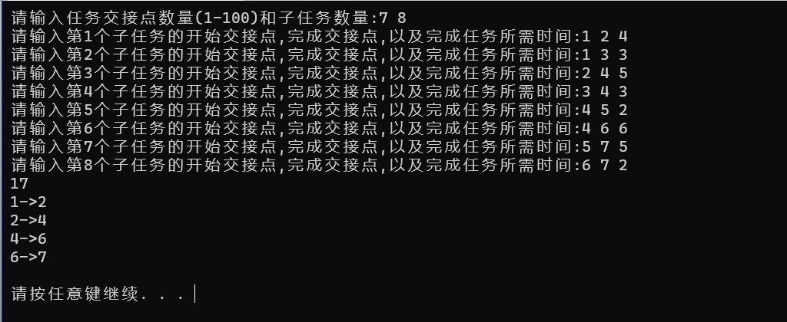
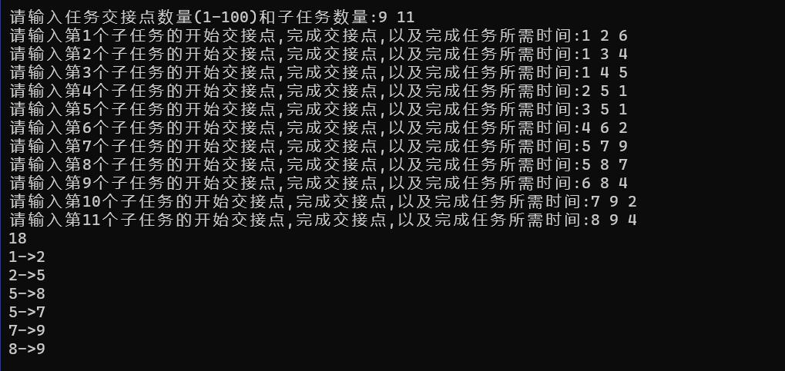
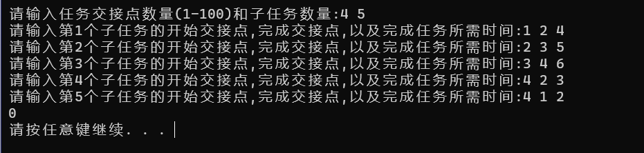
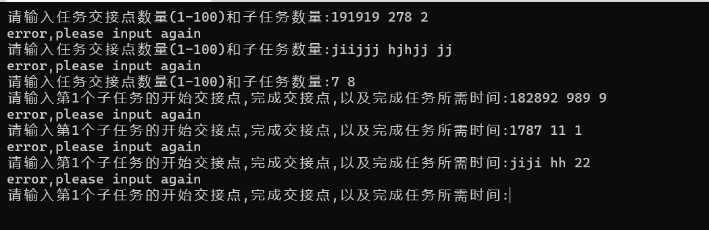

# 1 分析

## 1.1 背景分析

在生产活动中，有时候需要将一个大工程分割为一个个子任务，如果知道了完成每个子任务需要的时间，则可以算出完成整个工程项目需要的最短时间。在这些子任务中，有些任务即使推迟几天完成，也不会影响全局的工期；但是有些任务必须准时完成，否则整个项目的工期就要因此而延误，这些任务叫做“关键活动”。弄清楚哪些活动是关键活动可以帮助我们更有效率地优化项目时间，使生产活动更加高效。

## 1.2 功能分析

本题中给出各个子任务的完成时间，我们需要一个函数来计算出完成任务所需要的最短时间，同时还需要根据每个子任务的交接点以及完成时间计算出哪些活动是关键活动并输出。

# 2 设计

## 2.1 数据结构设计

由于本题中各个子任务间有交接点，可以考虑使用图来存储活动网络，图的点集存储交接点，图的边集存储各个子任务的完成时间，这种网络被称作AOE活动网络，本题我使用邻接表的数据结构存储图。邻接表是一种通过把每个节点的邻居存储在一个列表中来表示图的结构的方法。例如，如果一个节点 A 连接了节点 B 和节点 C，那么在邻接表中，A 节点的邻接列表将会包含 B 和 C 节点。邻接表的优点是它可以高效地存储稀疏图，也就是说，只有很少的节点有边相连的图。它的缺点是在稠密图，即大量节点都有边相连的情况。

## 2.2 类结构设计

### 2.2.1 邻接表类设计

邻接表用先用一个列表将图的点集存储，然后每个点都有一个指向这个点指向的第一个边的指针，边使用边节点存储，有一个成员表示该边指向点的下标，还有一个指针指向另一个与起始点相连的边节点。由于本题的关键活动需要是有向图，所以插入边的时候，要明确哪一个点是起始点，哪一个点是终点。

### 2.2.2 关键活动类设计

关键活动类中包含一个储存活动网络的邻接表和任务最短完成时间以及该活动的拓扑排序序列。还有一个用于接受用户输入信息并建立活动网络的函数和一个计算关键活动和最短时间的处理函数。

## 2.3 操作设计

### 2.3.1 邻接表类设计

#### 2.3.1.1 边节点设计

``` cpp
class edgeNode
{
public:
    int adjVexPos;
    int weight;
    edgeNode *next;
    edgeNode() : adjVexPos(-1), weight(0), next(nullptr){};
    edgeNode(int _adjVexPos, int _weight, edgeNode *_next = nullptr) : adjVexPos(_adjVexPos), weight(_weight), next(_next){};
};
```

#### 2.3.1.2 点设计

``` cpp
class vexNode
{
public:
    int name;
    edgeNode *firstEdgeNode;
    int inDegree;
    int outDegree;
    vexNode() : name(-1), inDegree(0), outDegree(0), firstEdgeNode(nullptr){};
    vexNode(int _name, edgeNode *_firstEdgeNode = nullptr) : name(_name), inDegree(0), outDegree(0), firstEdgeNode(_firstEdgeNode){};
};
```

#### 2.3.1.3 邻接表设计

``` cpp
class adjDirList
{
private:
    visitStatus *tags; // 访问标记数组
    int *topArray;     // 拓扑排序结果
    vexNode *vertices; // 结点数组
    int vexNum;        // 结点数量
    int edgeNum;       // 边的数量
    int vexMaxNum;     // 图的最大结点数量

public:
    adjDirList();                                                        // 默认构造函数，构造空图
    adjDirList(int *_names, int _vexNum, int _vexMaxNum = VEXMAXNUM);    // 构造包含多个结点的有向图
    ~adjDirList();                                                       // 析构函数，释放内存
    void clearAllEdges();                                                // 清除图中所有边
    bool isEmpty() const { return vexNum == 0; };                        // 判断图是否为空
    int getVexNum() const { return vexNum; };                            // 获取结点数量
    int getEdgeNum() const { return edgeNum; };                          // 获取边的数量
    int getVexMaxNum() const { return vexMaxNum; };                      // 获取图的最大结点数量
    int getName(int pos) const;                                          // 获取指定位置的结点名称
    int getPos(int name) const;                                          // 获取指定名称的结点位置
    int getWeight(int v1, int v2) const;                                 // 获取从结点 v1 到结点 v2 的边的权值
    int *getTopArray() const { return topArray; };                       // 获取拓扑排序结果数组
    int firstAdjVex(int v) const;                                        // 获取结点 v 的第一个邻接结点
    int nextAdjVex(int v, int w) const;                                  // 获取结点 v 的邻接结点 w 的下一个邻接结点
    bool addEdge(int startPos, int endPos, int weight);                  // 在结点 startPos 和 endPos 之间添加一条权值为 weight 的边
    bool addVex(int name);                                               // 向图中添加一个名称为 name 的结点
    bool removeEdge(int startPos, int endPos);                           // 删除结点 startPos 和 endPos 之间的边
    bool removeVex(int pos);                                             // 删除图中指定位置的结点
    friend ostream &operator<<(ostream &out, const adjDirList &l);       // 重载输出运算符，用于输出图的信息
    int getInDegree(int pos) const { return vertices[pos].inDegree; };   // 获取结点 pos 的入度
    int getOutDegree(int pos) const { return vertices[pos].outDegree; }; // 获取结点 pos 的出度
    bool topSort();                                                      // 拓扑排序
};
```

### 2.3.2 AOE网络类设计

``` cpp
class AOE
{
private:
    adjDirList project; // 项目图
    int *topArray;      // 拓扑排序结果数组
    int time;           // 最短完成时间

public:
    AOE() : topArray(nullptr), time(0){}; // 默认构造函数
    ~AOE();                               // 析构函数，释放内存
    void build_AOE();                     // 建立AOE网络
    void output_AOE();                    // 输出AOE网络
};
```

## 2.4 系统设计

首先创造一个AOE活动网络类，然后调用build_AOE函数建立AOE活动网络，然后再调用output_AOE函数输出关键活动和最短时间。

# 3 实现

## 3.1 邻接表核心操作实现

### 3.1.1 向邻接表中加入边

``` cpp
bool adjDirList::addEdge(int startPos, int endPos, int weight)
{
    // 判断边的起始位置和结束位置是否合法
    if (startPos >= 0 && startPos < vexNum && endPos >= 0 && endPos < vexNum && startPos != endPos)
    {
        // 在起始结点的链表中添加一个结点，表示从起始结点到结束结点的有向边
        vertices[startPos].firstEdgeNode = new edgeNode(endPos, weight, vertices[startPos].firstEdgeNode);
        // 更新起始结点的出度
        vertices[startPos].outDegree++;
        // 更新结束结点的入度
        vertices[endPos].inDegree++;
        // 更新边的数量
        edgeNum++;
        return true;
    }
    return false;
}
```

### 3.1.2 在邻接表中删除边

``` cpp
bool adjDirList::removeEdge(int startPos, int endPos)
{
    // 判断边的起始位置和结束位置是否合法
    if (startPos >= 0 && startPos < vexNum && endPos >= 0 && endPos < vexNum && startPos != endPos)
    {
        // 遍历起始结点的链表，找到与结束结点
        edgeNode *p = vertices[startPos].firstEdgeNode, *q;
        while (p && p->adjVexPos != endPos)
        {
            q = p;
            p = p->next;
        }
        // 如果找到了与结束结点，删除它
        if (p)
        {
            // 如果要删除的结点是链表的第一个结点，则更新链表的头指针
            if (vertices[startPos].firstEdgeNode == p)
                vertices[startPos].firstEdgeNode = p->next;
            // 否则更新链表中要删除结点的上一个结点的 next 指针
            else
                q->next = p->next;
            // 删除结点
            delete p;
            // 更新起始结点的出度
            vertices[startPos].outDegree--;
            // 更新结束结点的入度
            vertices[endPos].inDegree--;
            // 更新边的数量
            edgeNum--;
            return true;
        }
    }
    return false;
}
```

### 3.1.3 在邻接表中删除点

``` cpp
bool adjDirList::removeVex(int pos)
{
    // 判断要删除的结点是否合法
    if (pos >= 0 && pos < vexNum)
    {
        int i;
        edgeNode *p, *s, *q;
        // 删除该结点的出边
        while (vertices[pos].firstEdgeNode)
        {
            p = vertices[pos].firstEdgeNode;
            vertices[pos].firstEdgeNode = p->next;
            // 更新该结点所连接结点的入度
            vertices[p->adjVexPos].inDegree--;
            delete p;
        }
        // 遍历所有结点，删除所有指向该结点的边
        for (int i = 0; i < vexNum; i++)
        {
            if (i != pos)
            {
                s = vertices[i].firstEdgeNode;
                while (s && s->adjVexPos != pos)
                {
                    q = s;
                    s = s->next;
                }
                // 如果找到了指向该结点的边，则删除它
                if (s)
                {
                    // 如果要删除的结点是链表的第一个结点，则更新链表的头指针
                    if (vertices[i].firstEdgeNode == s)
                        vertices[i].firstEdgeNode = s->next;
                    // 否则更新链表中要删除结点的上一个结点的 next 指针
                    else
                        q->next = s->next;
                    // 更新该结点的出度
                    vertices[i].outDegree--;
                    // 删除结点
                    delete s;
                    // 更新边的数量
                    edgeNum--;
                }
            }
        }
        vexNum--;
        vertices[pos] = vertices[vexNum];
        vertices[vexNum].name = -1;
        vertices[vexNum].firstEdgeNode = nullptr;
        for (int i = 0; i < vexNum; i++)
        {
            if (i != pos)
            {
                p = vertices[i].firstEdgeNode;
                while (p)
                {
                    if (p->adjVexPos == vexNum)
                        p->adjVexPos = pos;
                    p = p->next;
                }
            }
        }
        return true;
    }
    return false;
}
```

### 3.1.4 拓扑排序

``` cpp
bool adjDirList::topSort()
{
    int top = -1, count = 0;         // top 为栈顶元素的索引，count 用来计数结果数组中已经加入了多少元素
    int *inDegree = new int[vexNum]; // 创建并初始化 inDegree 数组
    for (int i = 0; i < vexNum; i++)
        inDegree[i] = vertices[i].inDegree;
    for (int i = 0; i < vexNum; i++)
    {
        if (inDegree[i] == 0)
        {
            // 如果当前顶点的入度为 0，则将其入栈
            inDegree[i] = top;
            top = i;
        }
    }
    if (topArray)
        delete[] topArray;      // 清空原来的结果数组
    topArray = new int[vexNum]; // 创建新的结果数组
    while (top != -1)           // 只要栈不为空，就一直循环
    {
        topArray[count++] = getName(top); // 取出栈顶元素，加入结果数组
        int v = top;
        top = inDegree[top]; // 更新栈顶元素
        for (int i = firstAdjVex(v); i != -1; i = nextAdjVex(v, i))
        {
            if (--inDegree[i] == 0)
            {
                // 如果当前顶点的入度为 0，则将其入栈
                inDegree[i] = top;
                top = i;
            }
        }
    }
    delete[] inDegree; // 释放 inDegree 数组的内存
    if (count != vexNum)
        return false; // 如果结果数组的长度不等于图中顶点的数量，说明图中有环，拓扑排序失败
    else
        return true; // 如果结果数组的长度等于图中顶点的数量，则拓扑排序成功
}
```

## 3.2 计算关键活动和最短时间

在活动网络图中，$V_e$表示活动的最早开始时间，$V_l$表示活动的最晚开始时间。递推公式是一种方法，用来求解这些变量的值。这些公式通常是通过对活动网络图进行分析得到的。对于$V_e$和$V_l$，递推公式通常是类似的，并且需要考虑到活动的资源限制和前继活动。通常，$V_e$的递推公式是:
$$
V_e = max(V_e[j]) + d[i]，j为活动i的前继活动，d[i]为活动i的持续时间。
$$

$V_l$的递推公式则是:
$$
V_l = min(V_l[j]) - d[i]，其中j和d[i]的含义同上。
$$

这两个递推公式的计算必须在拓扑有序的情况下完成。

用$A_e$来表示一个活动的最早开始时间，则
$$
A_e[k]=V_e[i],A_e[k]的起始交接点为i,结束交接点为j
$$
用$A_l$来表示一个活动的最晚开始时间，则：
$$
A_l[k]=V_l[j]-d[k],d[k]是该活动的持续时间
$$
当$A_e==A_l$时，说明该活动不能被推迟，即为关键活动，求出关键活动代码如下

``` cpp
void AOE::output_AOE()
{
    if (!project.topSort()) // if exisits directed rings, cout 0
        cout << 0 << endl;
    else
    {
        int incidents = project.getVexNum(); // get the incidents nums

        topArray = new int[incidents]; // get the array of topsort
        int *tmp = project.getTopArray();
        for (int i = 0; i < incidents; i++)
            topArray[i] = tmp[i];

        int *ve = new int[incidents];
        int *vl = new int[incidents];
        int ae, al;

        for (int i = 0; i < incidents; i++)
            ve[i] = 0;
        for (int i = 0; i < incidents; i++) // 按照拓扑排序顺序计算Ve
        {
            for (int k = project.firstAdjVex(topArray[i] - 1); k != -1; k = project.nextAdjVex(topArray[i] - 1, k))
            {
                int w = project.getWeight(topArray[i] - 1, k);
                if (ve[topArray[i] - 1] + w > ve[k])
                    ve[k] = ve[topArray[i] - 1] + w;
            }
        }

        for (int i = 0; i < incidents; i++)
            vl[i] = INT32_MAX;
        vl[incidents - 1] = ve[incidents - 1];
        for (int i = incidents - 2; i >= 0; i--) // 按照逆拓扑排序计算Vl
        {
            for (int k = project.firstAdjVex(topArray[i] - 1); k != -1; k = project.nextAdjVex(topArray[i] - 1, k))
            {
                int w = project.getWeight(topArray[i] - 1, k);
                if (vl[k] - w < vl[topArray[i] - 1])
                    vl[topArray[i] - 1] = vl[k] - w;
            }
        }

        // 最短时间即为拓扑排序最后一个交接点的的最早开始时间
        time = ve[incidents - 1];
        cout << time << endl; // output the time;

        int cnt = 0;
        for (int i = 0; i < incidents; i++)
        {
            for (int j = project.firstAdjVex(topArray[i] - 1); j != -1; j = project.nextAdjVex(topArray[i] - 1, j))
            {
                int w = project.getWeight(topArray[i] - 1, j);
                // 计算ae和al
                ae = ve[topArray[i] - 1];
                al = vl[j] - w;
                if (ae == al) // 如果ae==al，则说明为关键活动
                {
                    cout << topArray[i] << "->" << j + 1 << endl;
                    cnt++;
                }
            }
        }
        cout << endl;
    }
}
```

# 4 测试

## 4.1 简单情况测试



## 4.2 一般情况测试，单个起点和单个终点



## 4.3 不可行的方案测试



## 4.4 错误输入测试

