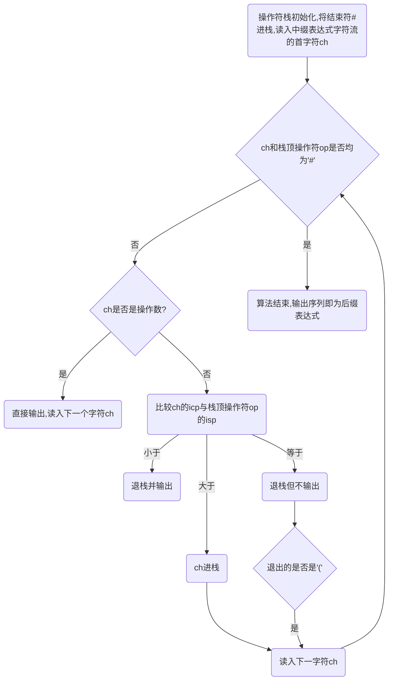
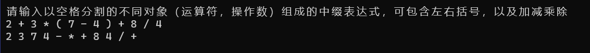
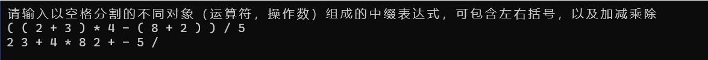
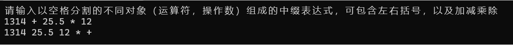
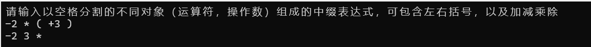
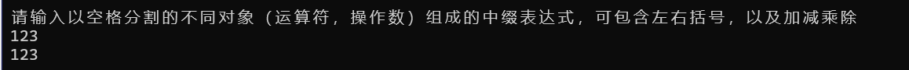

[toc]

# 1 分析

## 1.1 背景分析

任何一个表达式都是由操作数（亦称运算对象）、操作符（亦称运算符）和分界符组成。通常算术表达式有3种表示：

1. 中缀（infix）表示：<操作数><操作符><操作数>
2. 前缀（prefix）表示：<操作符><操作数><操作数>
3. 后缀（postfix）表式：<操作数><操作数><操作符>

由于中缀表示中有操作符的优先级问题，还有可加括号改变运算顺序的问题，所以对于编译程序来说，一般不采用中缀表达式，而采用后缀表达式，本题要求输入中缀表达式转化成后缀表达式。

## 1.2 功能分析

本题要求输入中缀表达式，输出转化后的后缀表达式，需要读入输入的中缀表达式的功能，以及对中缀表达式做处理转换成后缀表达式的功能，同时将后缀表达式输出，要能够处理负数，一个数字有多位和括号嵌套等多种情况。

# 2 设计

## 2.1 数据结构设计

本题涉及到中缀表达式转换成后缀表达式，需要用到栈这一数据结构，使用栈这一数据结构，将中缀表达式逐个读入，然后根据优先级进行处理，转换成后缀表达式输出。对栈要有基本的进栈和出栈操作。

## 2.2 类结构设计

本题中设计的类为Stack模板类，用于实现栈这一数据结构，完成进栈出栈等操作。

## 2.3 操作设计

### 2.3.1  Stack模板类

``` cpp
template<class T>
class Stack
{
private:
	T* elements;         //储存栈元素
	int top;             //栈顶元素指针
	int maxSize;         //栈的最大容量
	void overCapacity(); //栈满时扩容操作
public:
	Stack(int size = maxCapacity);
	~Stack();
	bool pop(T& tmp);    //出栈
	void push(T elem);   //进栈
	int getSize();       //得到栈的大小
	bool isEmpty();      //判断栈空否
	bool isFull();       //判断栈满否
	T getTop();          //获取栈顶元素
	bool reverse();      //将栈倒转
};
#endif // !_STACK_H_
```

## 2.4 系统设计

首先在main函数中用户输入中缀表达式，我们读入中缀表达式，然后对于每一个读入的数据进行是否是数字的判断，如果是就输出，不是则根据优先级判断进栈或出栈，最后输出后缀表达式。

# 3 实现

## 3.1 栈主要功能实现

### 3.1.1 进栈功能

``` cpp
template<class T>
inline void Stack<T>::push(T elem)
{
	if (isFull())              //如果栈满则扩容
		overCapacity();
	elements[++top] = elem;   //栈顶指针先+1然后元素进栈
}
```

### 3.1.2 出栈功能

``` cpp
template<class T>
inline bool Stack<T>::pop(T& tmp)
{
	if (!isEmpty())       //如果栈不空，先出栈，栈顶指针再自减
	{
		tmp = elements[top--];
		return true;
	}
	else                   //栈空，返回false
		return false;
}
```

## 3.2 中缀转后缀表达式功能实现

### 3.2.1 算术操作符优先级确定

我定义两种优先级，分别是：

- isp:栈内优先级
- icp:栈外优先级

用表格表示如下：

| 操作符ch |  #   |  (   | *,/,% | +,-  |  )   |
| :------: | :--: | :--: | :---: | :--: | :--: |
|   isp    |  0   |  1   |   5   |  3   |  6   |
|   icp    |  0   |  6   |   4   |  2   |  1   |

代码实现：

``` cpp
int isp(char x)      //栈内优先级
{
	int i = -1;
	switch (x)
	{
		case '(':
			i = 1;
			break;
		case')':
			i = 6;
			break;
		case'*':
			i = 5;
			break;
		case'/':
			i = 5;
			break;
		case'+':
			i = 3;
			break;
		case'-':
			i = 3;
			break;
		case'#':
			i = 0;
			break;
	}
	return i;
}

int icp(char ch)   //栈外优先级
{
	int i = -1;
	switch (ch)
	{
	case '(':
		i = 6;
		break;
	case')':
		i = 1;
		break;
	case'*':
		i = 4;
		break;
	case'/':
		i = 4;
		break;
	case'+':
		i = 2;
		break;
	case'-':
		i = 2;
		break;
	case'#':
		i = 0;
		break;
	}
	return i;
}
```

### 3.2.2 核心算法实现

由于题目要求能够读入多位的数字，故采用const char *实例化模板栈，读入时读入const char *数据，以空格分割，然后判断读入数据是否是数字，再对于不同的情况进行不同的操作。

核心算法操作流程如下：



代码如下：

``` cpp
cout << "请输入以空格分割的不同对象（运算符，操作数）组成的中缀表达式，可包含左右括号，以及加减乘除" << endl;
Stack<const char *> expression;
expression.push("#");
//const char* in = read();
char in[21];
cin >> in;
while(!expression.isEmpty())
{
    if (isNum(in))    //如果是数字
    {
        if (in[0] == '+')    //如果有符号
            for (char* pin = in + 1; *pin; pin++)
                cout << *pin;      //直接输出
        else
            cout << in;     //是数字直接输出
        cout << ' ';
        if (getchar() == '\n')
        {
            expression.push("#");
            in[0] = '#';
            in[1] = '\0';
        }
        else
            cin >> in;
    }
    else
    {
        if (icp(in[0]) > isp(expression.getTop()[0]))     //icp(ch)>isp(op)
        {
            char* i = new char[21];
            i[20] = '\0';
            char* pin = in, * pi = i;
            for (; *pi && *pin; pi++, pin++)
                *pi = *pin;
            *pi = '\0';
            expression.push(i);
            if (getchar() == '\n')
            {
                expression.push("#");
                in[0] = '#';
                in[1] = '\0';
            }
            else
                cin >> in;
        }
        else if (icp(in[0]) < isp(expression.getTop()[0]))       //icp(ch)<isp(op)
        {
            const char* x=nullptr;
            expression.pop(x);
            cout << x;
            cout << ' ';
        }
        else if (icp(in[0]) == isp(expression.getTop()[0]))     //icp(ch)==isp(op)
        {
            const char* x = nullptr;
            expression.pop(x);
            if (x[0] == '(')
            {
                if (getchar() == '\n')
                {
                    expression.push("#");
                    in[0]='#';
                    in[1] = '\0';
                }
                else
                    cin >> in;
            }
        }
    }
}
cout << '\b' << endl;

bool isNum(const char* ch)     //是否是数字
{
	if (strlen(ch) == 1&&(ch[0]>'9'||ch[0]<'0'))    //长度为1且不在0-9之间返回false
		return false;
	else
		return true;
}
```

# 4 测试

## 4.1 正常测试6种运算符



## 4.2 嵌套括号



## 4.3 运算数超过一位整数且有非整数出现



## 4.4 运算数有正或负号



## 4.5 只有一个数字

