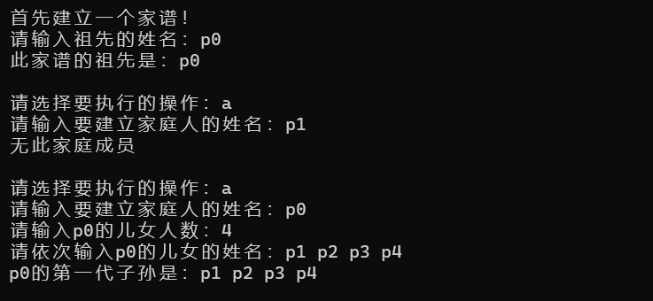
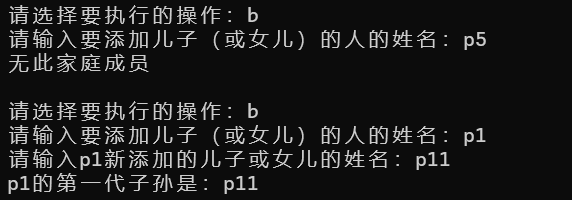
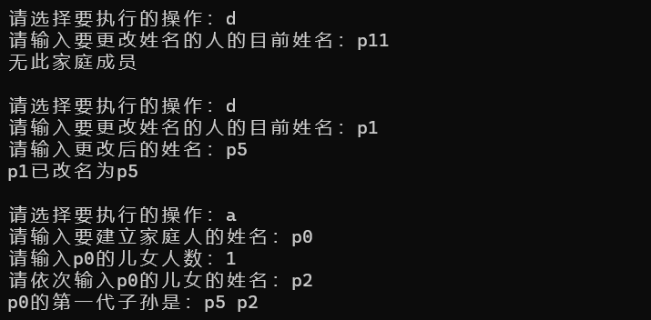

# 1 分析

## 1.1 背景分析

家谱记载着一个家族的历史，一直以来中国人民便很重视家族传统。本项目对家谱管理进行简单的模拟，以实现查看祖先和子孙个人信息，插入家族成员，删除家族成员的功能。

## 1.2 功能分析

实现家谱，需要完成的功能有创建家谱，对家谱进行增删改查的功能，对于上述功能都实现一个相对应的函数来完成即可。

# 2 设计

## 2.1 数据结构设计

多叉树的形式与家谱类似，且可以完成一系列增删改查等操作，故使用多叉树来存储家谱这一数据结构。需要具有的基本功能有创建树，对树的元素进行增删改查等功能。

## 2.2 类结构设计

本题中我设计了Tree类和treeNode类来实现多叉树，完成多叉树的各项功能，同时使用模板编程，方便储存不同种类的元素。Tree类中包含树的根节点以及树的当前节点，treeNode类中包含元素的值val和该节点的第一个孩子节点指针和其下一个兄弟节点指针来形成多叉树的链式结构。

## 2.3 操作设计

### 2.3.1 treeNode类设计

``` cpp
template <class T>
class treeNode
{
	friend class Tree<T>;
private:
	T val;
	treeNode<T>* firstChild;        //第一个孩子
	treeNode<T>* nextSibling;       //右兄弟
public:
	treeNode(treeNode<T>* fch = nullptr, treeNode<T>* ns = nullptr) :firstChild(fch), nextSibling(ns) {};
	treeNode(T data, treeNode<T>* fch = nullptr, treeNode<T>* ns = nullptr) :val(data), firstChild(fch), nextSibling(ns) {};
	void setVal(T data) { val = data; };
	T getVal()const { return val; };
};
```

### 2.3.2 Tree类设计

``` cpp
//Tree类
template <class T>
class Tree
{
private:
	treeNode<T>* root;
	treeNode<T>* current;
	bool findTarget(treeNode<T>* root, T target);                //根据值寻找，使寻找值成为current
	bool findParent(treeNode<T>* start, treeNode<T>* aim);       //以start为根寻找aim的双亲
	list<treeNode<T>*>* getChildren(treeNode<T> parent);         //得到parent节点下所有孩子,返回所有孩子的链表
	treeNode<T>* getChildByVal(treeNode<T>* parent, T val);             //以值找孩子
	treeNode<T>* insertByVal(treeNode<T>* parent, T val);               //通过值在parent下插入孩子
	void reMove(treeNode<T>* parent);
public:
	Tree();
	Tree(T val, treeNode<T>* fch = nullptr, treeNode<T>* ns = nullptr);
	~Tree() { reMove(root); };
	void removeChlidren(treeNode<T>* parent);                          //移除parent节点下所有孩子
	void insertChildren(treeNode<T>* parent, int childNum, list<T>* childrenVal);            //在parent节点下添加一定数量孩子
	bool isEmpty() { return root == nullptr; };                          //判断是否是空树
	bool find(T target);                                                 //找到目标，使之成为当前节点
	bool parent();
	list<treeNode<T>*>* children();
	bool childByVal(T val);
	bool insert(T val);
	treeNode<T>* getRoot() const { return root; };
	treeNode<T>* getCurrent() const { return current; };
	void outChidren(ostream& out);
};
```

## 2.4 系统设计

首先用户输入祖先的姓名，然后建立一个家谱树，然后用户可通过选择ABCDE来分别选择完善家谱、添加家庭成员、解散局部家庭、更改家庭成员姓名和退出程序这五项功能，对于没项功能分别有对应的函数来实现。

# 3 实现

## 3.1 多叉树的实现

实现多叉树，我采用了左孩子右兄弟方法储存树，相关核心功能有元素的查找删除改动等。

``` cpp
template<class T>
inline void Tree<T>::insertChildren(treeNode<T>* parent, int childNum, list<T>* childrenVal)
{
	listNode<T>* pval = childrenVal->getFirst();
	if (!parent->firstChild)
	{
		treeNode<T>* newNode = new treeNode<T>;
		parent->firstChild = newNode;
		parent->firstChild->setVal(pval->val);
		pval = pval->next;
		childNum--;
	}
	treeNode<T>* lastCh = parent->firstChild;
	while (lastCh->nextSibling)
		lastCh = lastCh->nextSibling;
	for (int i = 0; i < childNum; i++)
	{
		treeNode<T>* newNode = new treeNode<T>;
		newNode->setVal(pval->val);
		pval = pval->next;
		lastCh->nextSibling = newNode;
		lastCh = lastCh->nextSibling;	
	}
}

template<class T>
inline bool Tree<T>::find(T target)
{
	if (isEmpty())
		return false;
	else
		return findTarget(root, target);
}

template<class T>
inline bool Tree<T>::parent()
{
	if (current == nullptr || current == root)
	{
		current = nullptr;
		return false;
	}
	treeNode<T>* p = current;
	treeNode<T>* q = root;
	return findParent(q, p);
}

template<class T>
inline list<treeNode<T>*>* Tree<T>::children()
{
	if (current == nullptr)
		return nullptr;
	else
		return getChildren(current);
}

template<class T>
inline bool Tree<T>::childByVal(T val)
{
	if (current == nullptr)
		return false;
	else
	{
		treeNode<T>* p = getChildByVal(current, val);
		if (p)
		{
			current = p;
			return true;
		}
		else
			return false;
	}
}

template<class T>
inline bool Tree<T>::insert(T val)
{
	if (current == nullptr)
		return false;
	else
	{
		treeNode<T>* p = insertByVal(current, val);
		if (p)
		{
			current = p;
			return true;
		}
		else
			return false;
	}
}

template<class T>
inline void Tree<T>::outChidren(ostream& out)
{
	treeNode<T>* p = current->firstChild;
	while (p)
	{
		out << p->val << " ";
		p = p->nextSibling;
	}
	out << '\b';
}


template<class T>
inline treeNode<T>* Tree<T>::getChildByVal(treeNode<T>* parent, T val)
{
	if (parent == nullptr)
		return nullptr;
	else
	{
		treeNode<T>* p = parent->firstChild;
		while (p)
		{
			if (p->val == val)
				return p;
			p = p->nextSibling;
		}
	}
}

template<class T>
inline treeNode<T>* Tree<T>::insertByVal(treeNode<T>* parent, T val)
{
	if (parent == nullptr)
		return nullptr;
	else
	{
		treeNode<T>* p = parent->firstChild;
		treeNode<T>* q = new treeNode<T>;
		q->setVal(val);
		if (p == nullptr)                //若没有孩子，直接插入
			parent->firstChild = q;
		else
		{
			while (p->nextSibling)      //找到最后一个孩子，在其之后插入
				p = p->nextSibling;
			p->nextSibling = q;
			return q;
		}
	}
}

template<class T>
inline void Tree<T>::reMove(treeNode<T>* parent)
{
	if (parent)
	{
		reMove(parent->firstChild);
		reMove(parent->nextSibling);
		delete parent;
	}
}

template<class T>
inline bool Tree<T>::findTarget(treeNode<T>* root, T target)
{
	bool result = false;
	if (root->val == target)
	{
		result = true;
		current = root;
	}
	else
	{
		treeNode<T>* p = root->firstChild;
		while (p)
		{
			result = findTarget(p, target);
			if (result == true)
				break;
			p = p->nextSibling;
		}
	}
	return result;
}

template<class T>
inline bool Tree<T>::findParent(treeNode<T>* start, treeNode<T>* aim)
{
	bool result = false;
	treeNode<T>* p = start->firstChild;
	while (p && p != aim)
	{
		if (findParent(p, aim))
			return true;
		p = p->nextSibling;
	}
	if (p && p == aim)
	{
		current = start;
		result = true;
	}
	return result;
}

template<class T>
inline list<treeNode<T>*>* Tree<T>::getChildren(treeNode<T> parent)
{
	if (parent == nullptr)
		return nullptr;
	else
	{
		treeNode<T>* p = current->firstChild;
		list<treeNode<T>>* children;
		while (p)
		{
			children->pushBack(p);
			p = p->nextSibling;
		}
	}
	return children;
}

template<class T>
inline Tree<T>::Tree()
{
	treeNode<T>* p = new treeNode<T>;
	root = current = p;
	root->firstChild = nullptr;
	root->nextSibling = nullptr;
}

template <class T>
inline Tree<T>::Tree(T val, treeNode<T>* fch, treeNode<T>* ns)
{
	treeNode<T>* p = new treeNode<T>;
	root = current = p;
	root->val = val;
	root->firstChild = fch;
	root->nextSibling = ns;
}

template<class T>
inline void Tree<T>::removeChlidren(treeNode<T>* parent)
{
	if (parent)
	{
		treeNode<T>* fc = parent->firstChild;
		parent->firstChild = nullptr;
		reMove(fc);
	}
}

~Tree() { reMove(root); };     //一出根节点下所有孩子，完成析构
```

## 3.2 完善家谱功能实现

``` cpp
void buildFamily()
{
	cout << "请输入要建立家庭人的姓名：";
	string parent;
	cin >> parent;
	if (genealogy.find(parent))          //如果找到
	{
		cout << "请输入" << parent << "的儿女人数：";
		int childrenNum = 0;
		cin >> childrenNum;
		cout << "请依次输入" << parent << "的儿女的姓名：";
		list<string> childrenNames;
		string chName;
		for (int i = 0; i < childrenNum; i++)
		{
			cin >> chName;
			childrenNames.pushBack(chName);
		}
		genealogy.insertChildren(genealogy.getCurrent(), childrenNum, &childrenNames);
		cout << parent << "的第一代子孙是：";
		genealogy.outChidren(cout);
	}
	else                            //如果未找到
		cout << "无此家庭成员";
	cout << endl;
}
```

## 3.3 添加家庭成员功能实现

``` cpp
void addChild()
{
	cout << "请输入要添加儿子（或女儿）的人的姓名：";
	string parent;
	cin >> parent;
	if (genealogy.find(parent))
	{
		cout << "请输入" << parent << "新添加的儿子或女儿的姓名：";
		string child;
		cin >> child;
		genealogy.insert(child);
		genealogy.find(parent);
		cout << parent << "的第一代子孙是：";
		genealogy.outChidren(cout);
	}
	else
		cout << "无此家庭成员";
	cout << endl;
}
```

## 3.4 解散局部家庭功能实现

``` cpp
void removeFamily()
{
	cout << "请输入要解散家庭人的姓名：";
	string parent;
	cin >> parent;
	if (genealogy.find(parent))
	{
		cout << "要解散家庭人的姓名是：" << parent << endl;
		cout << parent << "的待解散子女为：";
		genealogy.outChidren(cout);
		genealogy.removeChlidren(genealogy.getCurrent());
	}
	else
		cout << "无此家庭成员";
	cout << endl;
}

template<class T>
inline void Tree<T>::removeChlidren(treeNode<T>* parent)
{
	if (parent)
	{
		treeNode<T>* fc = parent->firstChild;
		parent->firstChild = nullptr;
		reMove(fc);       
	}
}

template<class T>
inline void Tree<T>::reMove(treeNode<T>* parent)
{
	if (parent)
	{
		reMove(parent->firstChild);        //递归删除左孩子
		reMove(parent->nextSibling);       //递归删除右兄弟
		delete parent;
	}
}
```

## 3.5 更改家庭成员姓名实现

``` cpp
void modifyChild()
{
	cout << "请输入要更改姓名的人的目前姓名：";
	string lastName;
	cin >> lastName;
	if (genealogy.find(lastName))
	{
		cout << "请输入更改后的姓名：";
		string nowName;
		cin >> nowName;
		genealogy.getCurrent()->setVal(nowName);
		cout << lastName << "已改名为" << nowName;
	}
	else
		cout << "无此家庭成员";
	cout << endl;
}
```

# 4 测试

## 4.1 完善家谱功能测试



## 4.2 添加家庭成员功能测试



## 4.3 解散局部家庭功能实现


## 4.4 更改家庭成员姓名功能测试



 