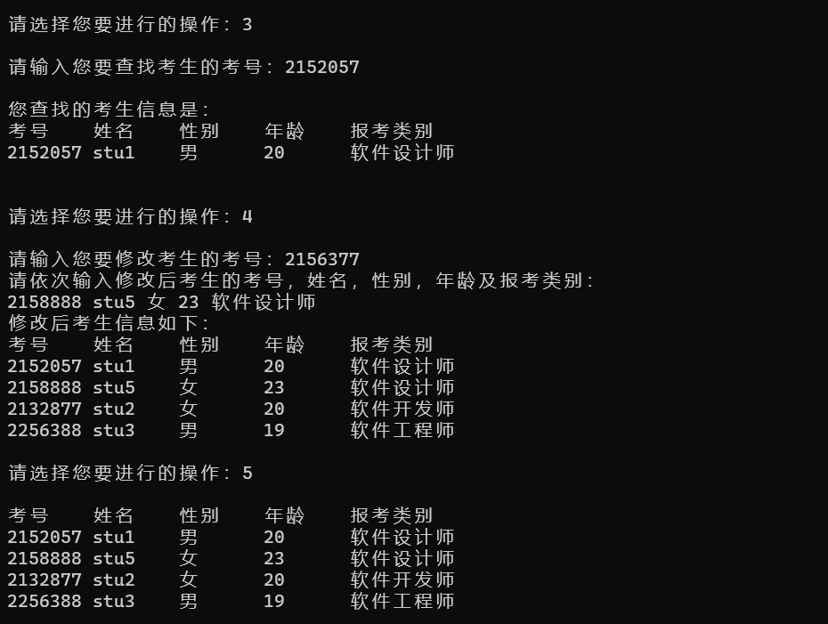
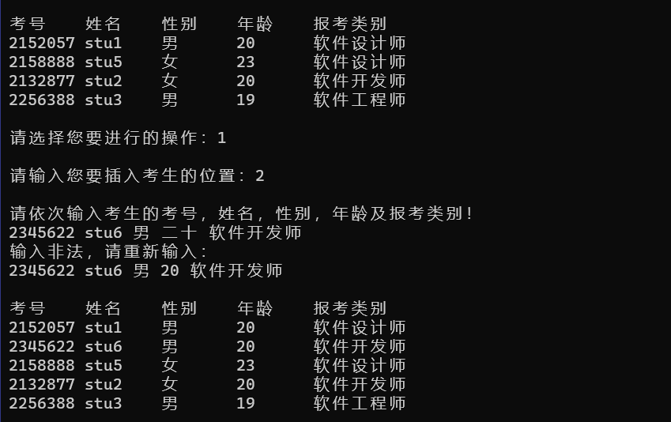
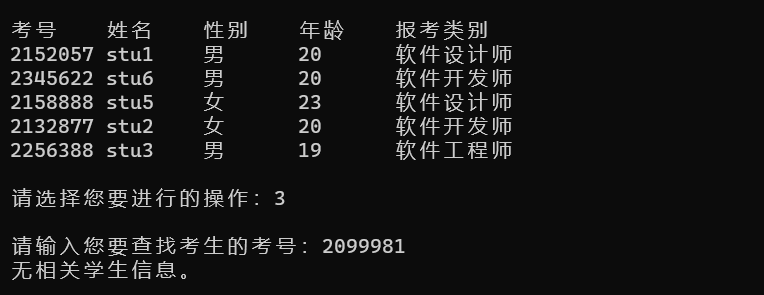

[toc]

## 1 分析

### 1.1 背景分析

考试报名工作一直是各大高校招生的重要工作，也给各高校带来了新的挑战，给教务部门增加了很大的工作量。本项目需要设计一个考试报名系统来完成有关考生信息的处理。能够用控制台选项的方式完成以下功能：输入考生信息；输出考生信息；查询考生信息；添加考生信息；修改考生信息；删除考生信息。

### 1.2 功能分析

本项目要求对考生的信息进行建立，以及完成对考生信息的增删改查一系列操作。故可考虑使用链表来完成。使用链表来存储考生的基本信息，同时使用链表的基本操作来完成对于考生信息的建立，查找，插入，修改，删除等功能。

## 2 设计

### 2.1 数据结构设计

显然，由于本项目涉及到对许多信息的增删改查等功能，故使用链表来存储考生相关信息。若使用数组，则会在增加和删除元素的时候移动许多额外元素从而浪费许多时间和空间。

### 2.2 类结构设计

用链表来存储考生信息，首先我们要设计一个考生信息类，用于储存考生信息，如考号，姓名，性别，年龄以及报考类别；然后设计链表节点类，使用模板编程，可以方便地将链表节点替换成任意的数据类型，包括考生信息类，节点中应包含本节点存储数据的值以及指向直接后继的指针；最后设计链表类，链表中包含一个first指针，指向链表中的第一个元素，同时还需要一些增删改查等链表相关操作函数。

### 2.3 操作设计

- **学生信息类：**

  ``` cpp
  class stuInfo
  {
  public:
  	int stuNum=0;   //考号
  	string stuName; //姓名
  	string stuSex;  //性别
  	int stuAge=0;   //年龄
  	string stuAim;  //报考目标
  	//重载学生输入输出
  	friend ostream& operator<<(ostream& out, stuInfo s);   
  	friend istream& operator>>(istream& in, stuInfo& s);
  };
  ```

- **链表节点类：**

  ``` cpp
  template<class T>
  class listNode
  {
  public:
  	T val;    //节点数据
  	listNode<T>* next;  //下一节点
  };
  ```

- **链表类：**

  ``` cpp
  template<class T>
  class list :public listNode<T>
  {
  	//重载输入输出运算符
  	template <class S>
  	friend ostream& operator<<(ostream& out, list<S> x);
  	template <class Q>
  	friend istream& operator>>(istream& in, list<Q>& x);
  private:
  	listNode<T>* first;
  public:
  	list();       //构造函数
  	~list();      //析构函数
  	bool empty() const;   //链表是否为空
  	int getLength()const;  //获取链表长度
  	listNode<T>* find(T elem);   //找到指定元素
  	bool insert(int i, T& elem);    //插入指定位置元素
  	bool remove(int i, T& elem);    //删除指定位置元素
  	bool pushBack(T& elem);    //在末尾加入元素
  	void display() const;      //输出链表
  	listNode<T>* getFirst() { return first; };    //返回首个节点
  };
  ```

### 2.4 系统设计

首先系统建立考生信息，用户输入考生数量以及考生相关信息，系统调用pushBack()函数向链表中加入考生信息，然后用户可以选择执行相应的增删改查操作，通过一个条件语句来完成不同功能的选择，然后调用不同的函数。

## 3 实现

### 3.1 插入功能实现

- **链表中插入：**

  ``` cpp
  template<class T>
  bool list<T>::insert(int i, T& elem)
  {
  	if (i == 0 || first == nullptr)           //如果在头部插入或链表为空
  	{
  		listNode<T>* newNode = new listNode<T>;
  		if (!newNode)
  		{
  			cerr << "Error allocating memory!" << endl;
  			return false;
  		}
  		newNode->val = elem;
  		newNode->next = first;
  		first = newNode;
  	}
  	else                                   //在中间或尾部插入
  	{
  		listNode<T>* current = first;
  		for (int k = 1; k < i; k++)      //首先遍历至要插入位置
  		{
  			if (current == nullptr)
  				break;
  			else
  				current = current->next;
  		}
  		if (current == nullptr)
  		{
  			cerr << "invalid insertion postion!" << endl;   
  			return false;
  		}
  		else
  		{
  			listNode<T>* newNode = new listNode<T>;    
  			if (!newNode)
  			{
  				cerr << "Error allocating memory!" << endl;
  				return false;
  			}
  
  			//插入链表之中
  			newNode->next = current->next;
  			newNode->val = elem;
  			current->next = newNode;
  		}
  	}
  	return true;
  }
  ```

- **交互界面插入功能：**

  ``` cpp
  if (choose == 1)
  {
      while (1)
      {
          cout << endl << "请输入您要插入考生的位置：";
          int pos = 0;
          cin >> pos;
          if (pos<1 || pos>num + 1)
          {
              cout << "插入位置有误，请重新插入。" << endl;
              continue;
          }
          else
          {
              cout << endl << "请依次输入考生的考号，姓名，性别，年龄及报考类别！" << endl;
              stuInfo insertStu;
              cin >> insertStu;
              bool flagOfInsert = true;
              flagOfInsert = stuList.insert(pos - 1, insertStu);
              display(stuList, stuList.getLength());
              break;
          }
      }
  }
  ```

### 3.2 删除功能实现

- **链表中删除：**

  ``` cpp
  template<class T>
  bool list<T>::remove(int i, T& elem)
  {
  	listNode<T>* del, * current;
  	if (i == 1)        //如果移除第一个
  	{
  		del = first;
  		first = first->next;
  	}
  	else             //移除中间或末尾
  	{
  		current = first;
  		for (int k = 1; k < i - 1; k++)    //遍历至要删除位置
  			current = current->next;
  		if (current == nullptr || current->next == nullptr || i < 1)
  		{
  			cerr << "invalid remove position!" << endl;
  			return false;
  		}
  		del = current->next;
  		current->next = del->next;
  	}
  	elem = del->val;
  	delete del;   //删除
  	return true;
  }
  ```

- **交互界面删除功能：**

  ``` cpp
  else if (choose == 2)
  {
      while (1)
      {
          cout<<endl << "请输入您要删除考生的考号：";
          int pos = 0;
          cin >> pos;
          listNode<stuInfo>* ptr = stuList.getFirst();
          int cnt = 1;
          while (ptr)      //通过考号寻找考生位置
          {
              if (ptr->val.stuNum == pos)
                  break;
              ptr = ptr->next;
              cnt++;
          }
          if (!ptr)      //未找到考生
              cout << "无相关学生信息。" << endl;
          else
          {
              stuInfo reMoveStu;
              stuList.remove(cnt, reMoveStu);    //删除考生信息
              cout << "您删除的考生信息是：" << reMoveStu << endl;
              display(stuList, stuList.getLength());
              break;
          }
      }
  }
  ```

### 3.3 查找功能实现

- **交互界面查找功能：**

  ``` cpp
  else if (choose == 3)
  {
      while (1)
      {
          cout <<endl<< "请输入您要查找考生的考号：";
          int pos = 0;
          cin >> pos;
          listNode<stuInfo>* ptr = stuList.getFirst();
          while (ptr)
          {
              if (ptr->val.stuNum == pos)    //通过考号查找考生信息
                  break;
              ptr = ptr->next;
          }
          if (!ptr)
              cout << "无相关学生信息。" << endl;    //未找到
          else
          {
              stuInfo findStu=ptr->val;   //找到后输出
              cout <<endl<< "您查找的考生信息是：" <<endl<< "考号\t姓名\t性别\t年龄\t报考类别" << endl<< findStu 				  << endl;
              break;
          }
      }
  }
  ```

### 3.4 修改功能实现

- **交互界面修改功能：**通过考号找到考生信息后，再次输入考生信息来修改

  ``` cpp
  else if (choose == 4)
  {
      while (1)
      {
          cout << endl << "请输入您要修改考生的考号：";
          int pos = 0;
          cin >> pos;
          listNode<stuInfo>* ptr = stuList.getFirst();
          while (ptr)
          {
              if (ptr->val.stuNum == pos)   //通过考号寻找考生信息
                  break;
              ptr = ptr->next;
          }
          if (!ptr)
              cout << "无相关学生信息。" << endl;
          else
          {     
              cout << "请依次输入修改后考生的考号，姓名，性别，年龄及报考类别：" << endl;
              stuInfo modifyStu;
              cin >> modifyStu;   //找到后修改考生信息
              ptr->val = modifyStu;
              cout << "修改后考生信息如下：";
              display(stuList, stuList.getLength());
              break;
          }
      }
  }
  ```

### 3.5 统计功能实现

- **交互界面统计功能：**将考生信息输出即可

  ``` cpp
  else if (choose == 5)
  		{
  			display(stuList, stuList.getLength());
  		}
  ```

- **输出考生信息功能：**

  ``` cpp
  void display(list<stuInfo>& stuList,int num)
  {
  	if (num == 0)
  		cout << "无考生信息。" << endl;
  	else
  	{
  		cout << endl << "考号\t姓名\t性别\t年龄\t报考类别" << endl;
  		listNode<stuInfo>* ptr = stuList.getFirst();
  
  		for (int i = 0; i < num; i++)
  		{
  			cout << ptr->val;
  			ptr = ptr->next;
  		}
  	}
  }
  ```

- **输出单个考生信息功能：**重载考生信息类输出运算符

  ``` cpp
  ostream& operator<<(ostream& out, stuInfo s)
  {
  	out << s.stuNum << '\t' << s.stuName << '\t' << s.stuSex << '\t' << s.stuAge << '\t' << s.stuAim << 		endl;
  	return out;
  }
  ```

## 4 测试

### 4.1 正常样例测试




### 4.2 输入考生信息出错



### 4.3  输入无效考生考号

