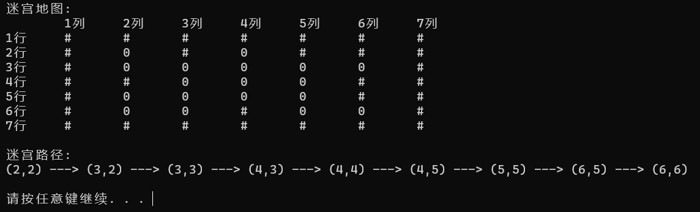

[toc]

# 1 分析

## 1.1 背景分析

随着科技的发展与人民需求的增长，自动寻路功能应运而生，自动寻路功能被广泛应用在导航，游戏Ai等设计中，故设计一个迷宫寻路程序，也有了丰富的现实意义。

## 1.2 功能分析

要实现迷宫寻路，首先我们需要将迷宫存储的功能，其次我们要有一个根据迷宫求得最短路径的函数，最后要有一个输出最短路径的函数。本题中我使用A*算法来计算最短路径。

# 2 设计

## 2.1 数据结构设计

由于A*算法中需要用一个openList来存储待检查的周围格点，且求得最优代价格点，需要求得最小值，故考虑使用最小堆实现的优先级队列，最小堆中序列使用vector存储，故还需要设计一个vector。

## 2.2 类结构设计

### 2.2.1 Vector模板类

使用一段连续空间存储数据，具有增删改查等功能，先指定一个最大容量，若后续加入数据，容量不够则扩充容量。

### 2.2.2 priorityQueue模板类

使用最小堆实现，对于一个节点，满足其值小于其孩子节点的值，每次插入弹出元素时都对这种性质进行维护，使得每次弹出的元素都是序列中最小的元素，元素使用Vector储存，通过下标给每个节点指定父亲节点以实现树的性质。

### 2.2.3 迷宫格点类

具有该格点行列以及父亲格点指针和A*算法中F,G,H值私有成员，同时有重载输出运算符以及重载比较运算符的运算符重载函数等公有成员

### 2.2.4 A*算法格点状态枚举类

A*算法中格点有三种状态

- 未被访问
- 已访问待探索
- 已访问已探索

故使用一个枚举类来包括这三种状态

### 2.2.5 格点类别枚举类

迷宫中格点有两种状态

- 可通行
- 障碍物

故使用一个枚举类来包括这两种状态

### 2.2.6 迷宫类

用二维指针存储迷宫，且分别用两个二维指针存储格点的状态以及类别，以及计算F,G,H值的函数和A*算法计算函数以及最短路径输出函数。

## 2.3 操作设计

### 2.2.1 Vector模板类

``` cpp
template <class T>
class Vector
{
private:
    T* elements = nullptr;
    int maxSize = 0;
    int length = maxSize;
    void setMaxSize(int size) { maxSize = size; };
    void overSize();

public:
    Vector() : maxSize(0), length(0), elements(nullptr) {};
    Vector(int size) : maxSize(size), length(size)
    {
        if (size > 0)
        {
            elements = new T[size];
            if (!elements)
                std::cerr << "wrong memeory allocation!\n";
        }
        else
            elements = nullptr;
    };
    Vector(int size, T elem) : maxSize(size), length(size)
    {
        if (size > 0)
        {
            elements = new T[size];
            if (!elements)
                std::cerr << "wrong memeory allocation!\n";
            for (int i = 0; i < size; i++)
                elements[i] = elem;
        }
        else
            elements = nullptr;
    };
    Vector(const Vector<T>& v) : elements(v.elements), maxSize(v.maxSize), length(v.length) {};
    ~Vector() { delete[] elements; };
    void pushBack(const T& elem);
    int getLength() const { return length; };
    void insert(int i, const T& elem);
    T remove(int i);
    void reMove(const T& aim);
    T minElem();
    T maxElem();
    T& operator[](int i) const;
    int find(const T& elem) const;
    T sum();
    void makeEmpty();
};
```

### 2.3.2 priorityQueue模板类

``` cpp
template <class T>
class priorityQueue
{
private:
    int size;				// the size of the queue
    Vector<T> heap;			// to store the data
    void filterUp(int i);	// to maintain the minHeap from bottle to top
    void filterDown(int i); // to maintain the minHeap from top to bottle
    T popMin();				// pop the minimal elem
    int parent(int i);		// return the position of parent
    int left(int i);		// return the position of left child
    int right(int i);		// return the posision of right child
    void swap(T& a, T& b);	// swap the value of a,b
public:
    priorityQueue();
    ~priorityQueue();
    bool empty();	   // judge whether the queue is empty
    T pop();		   // out of the queue
    void push(T elem); // into the queue
};
```

### 2.3.3 迷宫格点类

``` cpp
class grid //迷宫格点类
{
private:
    int row;				//行
    int col;				//列
    int F = 0;				// A*算法评估值，F=G+H
    int G = 0;				//起点到该点的移动代价
    int H = 0;				//该点到终点的估算成本
    grid* parent = nullptr; //该格点的父亲格点目录
public:
    grid() : row(0), col(0) {};
    grid(int r, int c) : row(r), col(c) {};
    void set_rc(int r, int c) { row = r, col = c; };
    int getF() const { return F; };
    int getG() const { return G; };
    int getH() const { return H; };
    int getRow() const { return row; };
    int getCol() const { return col; };
    grid* getParent() const { return parent; };
    void setF(int f) { F = f; };
    void setG(int g) { G = g; };
    void setH(int h) { H = h; };
    void setParent(grid* p) { parent = p; };
    friend ostream& operator<<(ostream& out, grid a);
    bool operator<=(const grid& other) const;
    bool operator>=(const grid& other) const;
    bool operator>(const grid& other) const;
    bool operator<(const grid& other) const;
    void operator=(const grid& other);
};
```

### 2.3.4 A*算法格点状态枚举类

``` cpp
// A*算法格点状态枚举类
enum class status
{
    OPEN,
    CLOSED,
    UNVISIT
};
```

### 2.3.5 格点类别枚举类

``` cpp
//格点类别枚举类
enum class category
{
    WALL,
    PATH
};
```

### 2.3.6 迷宫类

``` cpp
//迷宫类
class maze
{
private:
    int row;		//行数
    int col;		//列数
    grid** m_maze;	//存储迷宫的二维指针
    status** tags;	//存储迷宫格点A*算法状态
    category** cgy; //存储迷宫格点类别

    /*函数功能：计算A*算法G值
      传入参数：当前格点行，当前格点列，起始格点行，起始格点列
      返回值：  计算得到的G*/
    int calculateG(int c_row, int c_col, int s_row, int s_col);

    /*函数功能：计算A*算法G值
      传入参数：当前格点行，当前格点列，终点行，终点列
      返回值：  计算得到的H值*/
    int calculateH(int c_row, int c_col, int a_row, int a_col);

    /*函数功能：计算A*算法F值
      传入参数：当前格点行，当前格点列
      返回值：  计算得到的F值*/
    int calculateF(int c_row, int c_col);

    /*函数功能：将格点加入openList
      传入参数：要加入进openList的格点横纵坐标*/
    void addOpenList(int c_row, int c_col);

    /*函数功能：将格点加入closedList
      传入参数：要加入进closedList的格点横纵坐标*/
    void addClosedList(int c_row, int c_col);

    /*函数功能：A*算法对当前格点相邻处理
      传入参数：status:指明相邻格点相对当前格点位置
              当前格点横纵坐标
              终点横纵坐标
              openList最小堆*/
    void dealAdjGrid(int status, int s_row, int s_col, int a_row, int a_col, priorityQueue<grid>& openQueue);

public:
    maze(int _row = 0, int _col = 0, category** _cgy = nullptr);
    ~maze();

    /*函数功能：用A*算法搜索终点
      传入参数：起始点横纵坐标，终点横纵坐标*/
    void A_star(int s_row, int s_col, int a_row, int a_col);
    /*函数功能：输出迷宫路径
      传入参数：终点横坐标，终点纵坐标*/
    void outPath(int a_row, int a_col);
    category** getCgy() const { return cgy; };
};
```

## 2.4 系统设计

首先初始化迷宫类实例m,调用m的A_star()方法搜索终点，然后调用outpath()函数输出最短路径。

# 3 实现

## 3.1 最小堆性质维护实现

每次向最小堆中插入时，在序列尾部插入然后自底向上调整维护最小堆性质，弹出时弹出序列第一位，然后将序列最后一位元素填充至首位，再自顶向下调整维护堆的性质。

``` cpp
//自底向上调整
template <class T>
void priorityQueue<T>::filterUp(int i)
{
    if (heap.getLength())
    {
        int k = size - 1;
        int j = parent(k);
        T temp = heap[k];
        while (k > i)
        {
            if (heap[k] >= heap[j])
                break;
            else
            {
                heap[k] = heap[j];
                k = j;
                j = parent(j);
            }
            heap[k] = temp;
        }
    }
}

//自顶向下调整
template <class T>
inline void priorityQueue<T>::filterDown(int i)
{
    if (heap.getLength())
    {
        int j = left(i);
        T temp = heap[i];
        while (j <= size - 1)
        {
            if (j < size - 1 && heap[j] > heap[j + 1])
                j++;
            if (temp <= heap[j])
                break;
            else
            {
                heap[i] = heap[j];
                i = j;
                j = 2 * j + 1;
            }
            heap[i] = temp;
        }
    }
}
```

## 3.2 A*算法实现

A* 算法由一个估价函数F来确定迷宫最短路径，F的计算方法为
$$
F=G+H
$$
其中

G = 从起点 A 移动到指定方格的移动代价，沿着到达该方格而生成的路径。

H = 从指定的方格移动到终点 B 的估算成本。这个通常被称为试探法，有点让人混淆。为什么这么叫呢，因为这是个猜测。直到我们找到了路径我们才会知道真正的距离，因为途中有各种各样的东西 ( 比如墙壁，水等 ) 。

本题中由于路径只能横向或纵向移动，设定每次横向或纵向移动的代价为10，则某一点g的G值为它的前一个点m的G值加上10，而H为该点到终点路径长度的平方(为了计算方便)，计算F,G,H的函数如下

``` cpp
	/*函数功能：计算A*算法G值
      传入参数：当前格点行，当前格点列，起始格点行，起始格点列
      返回值：  计算得到的G*/
int maze::calculateG(int c_row, int c_col, int s_row, int s_col)
{
    //假定横向与纵向移动代价均为10
    return m_maze[s_row - 1][s_col - 1].getG() + 10;
}

	/*函数功能：计算A*算法H值
      传入参数：当前格点行，当前格点列，终点行，终点列
      返回值：  计算得到的H值*/
int maze::calculateH(int c_row, int c_col, int a_row, int a_col)
{
    //采用该格点到终点的直线距离的平方为H值
    return (a_row - c_row) * (a_row - c_row) + (a_col - c_col) * (a_col - c_col);
}

    /*函数功能：计算A*算法F值
      传入参数：当前格点行，当前格点列
      返回值：  计算得到的F值*/
int maze::calculateF(int c_row, int c_col)
{
    // F=G+H
    return m_maze[c_row - 1][c_col - 1].getG() + m_maze[c_row - 1][c_col - 1].getH();
}
```

A*算法每次将周围的待探索点加入openList中，已探索点加入closedList中，每次从openList中寻找出最小F值点作为下一次循环的起始点，并将其加入到closedList中。

从起始点开始，每次执行以下步骤：

1. 判断周围四点性质，若非墙且不在closedList中，则进入处理路程
2. 处理流程：该点若不在openList中，计算其F值，将其加入到openList中；若在openList中，则计算由当前点到该点的G值，若小于其原来G值，更改其G值，并将其父亲指针设为当前节点，若不小于，则不做任何动作
3. 取得openList中F值最小的点，将其作为新的起始点，重复以上步骤
4. 直到终点被加入到closedList中，停止循环
5. 从终点开始顺着父亲指针找到起始点，经过路径便是最短路径

代码实现如下：

``` cpp
    /*函数功能：A*算法对当前格点相邻处理
      传入参数：status:指明相邻格点相对当前格点位置
              当前格点横纵坐标
              终点横纵坐标
              openList最小堆*/
void maze::dealAdjGrid(int status, int s_row, int s_col, int a_row, int a_col, priorityQueue<grid>& openQueue)
{
    //根据status计算相邻格点横纵坐标
    int adjRow = s_row, adjCol = s_col;
    if (status == 1)
        adjRow = s_row - 1;
    else if (status == 2)
        adjCol = s_col - 1;
    else if (status == 3)
        adjRow = s_row + 1;
    else if (status == 4)
        adjCol = s_col + 1;
    else
    {
        cerr << "错误的方向状态" << endl;
        return;
    }

    //若非墙，且不在closedList中
    if (cgy[adjRow - 1][adjCol - 1] != category::WALL && tags[adjRow - 1][adjCol - 1] != status::CLOSED)
    {
        int lastG = m_maze[adjRow - 1][adjCol - 1].getG();      //存储之前已计算G值
        m_maze[adjRow - 1][adjCol - 1].setG(calculateG(adjRow, adjCol, s_row, s_col));
        if (tags[adjRow - 1][adjCol - 1] == status::OPEN)       //如果相邻点已在openList中
        {
            if (m_maze[adjRow - 1][adjCol - 1].getG() < lastG)     //计算出新G值小于原来G值
            {
                m_maze[adjRow - 1][adjCol - 1].setParent(&m_maze[s_row - 1][s_col - 1]);    //更改相邻点父亲为当前节点
                openQueue.push(m_maze[adjRow - 1][adjCol - 1]);   //加入最小堆
            }
            else
                m_maze[adjRow - 1][adjCol - 1].setG(lastG);     //若不在openList中则保留上次G值
        }

        //计算H与F
        m_maze[adjRow - 1][adjCol - 1].setH(calculateH(adjRow, adjCol, a_row, a_col));
        m_maze[adjRow - 1][adjCol - 1].setF(calculateF(adjRow, adjCol));
        if (tags[adjRow - 1][adjCol - 1] != status::OPEN)   //若不在openList中则加入到openList中
        {
            addOpenList(adjRow, adjCol);
            m_maze[adjRow - 1][adjCol - 1].setParent(&m_maze[s_row - 1][s_col - 1]);
            openQueue.push(m_maze[adjRow - 1][adjCol - 1]);
        }
    }
}

    /*函数功能：用A*算法搜索终点
      传入参数：起始点横纵坐标，终点横纵坐标*/
void maze::A_star(int s_row, int s_col, int a_row, int a_col)
{
    priorityQueue<grid> openQueue;
    while (1)
    {
        addClosedList(s_row, s_col);
        if (tags[a_row - 1][a_col - 1] == status::CLOSED)
            break;
        dealAdjGrid(1, s_row, s_col, a_row, a_col, openQueue);     //对相邻格点处理
        dealAdjGrid(2, s_row, s_col, a_row, a_col, openQueue);
        dealAdjGrid(3, s_row, s_col, a_row, a_col, openQueue);
        dealAdjGrid(4, s_row, s_col, a_row, a_col, openQueue);
        grid best = openQueue.pop();
        s_row = best.getRow();
        s_col = best.getCol();
    }
}

	/*函数功能：输出迷宫路径
      传入参数：终点横坐标，终点纵坐标*/
void maze::outPath(int a_row, int a_col)
{
    cout << endl
         << "迷宫路径:" << endl;
    Vector<grid> path;

    while (1)
    {
        //从终点出发，寻找父亲格点，一直找到起始点即为最短路径
        grid* p = m_maze[a_row - 1][a_col - 1].getParent();
        path.pushBack(m_maze[a_row - 1][a_col - 1]);
        if (p == nullptr)
            break;
        a_row = p->getRow();
        a_col = p->getCol();
    }

    int len = path.getLength();
    //逆序输出
    for (int i = len; i > 0; --i)
    {
        if (i == 1)
            cout << path[i - 1];
        else
            cout << path[i - 1] << " ---> ";
    }
    cout << endl;
}
```

# 4 测试

## 4.1 结果测试

- 迷宫数据：

   ``` cpp
  int map[7][7] = { 0, 0, 0, 0, 0, 0, 0,       //0代表不可走，1代表可走
                        0, 1, 0, 1, 0, 0, 0,
                        0, 1, 1, 1, 1, 1, 0,
                        0, 0, 1, 1, 1, 0, 0,
                        0, 1, 1, 1, 1, 0, 0,
                        0, 1, 1, 0, 1, 1, 0,
                        0, 0, 0, 0, 0, 0, 0 };
  ```

- 输出结果：

  