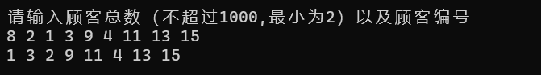

[toc]

# 1 分析

## 1.1 背景分析

银行在居民生活中有着重要的作用，而银行每个窗口处理业务的速度也都不一样，预测业务完成的顺序，可以帮助银行更好的调度工作资源。

## 1.2 功能分析

本题中假设银行有A，B两个业务窗口，且处理业务的速度不一样，其中A窗口处理速度是B窗口的2倍----即当A窗口每处理完2个顾客是，B窗口处理完1个顾客。给定到达银行的顾客序列，请按照业务完成的顺序输出顾客序列。假定不考虑顾客信后到达的时间间隔，并且当不同窗口同时处理完2个顾客时，A窗口的顾客优先输出。输入为一行正整数，其中第一数字N（N<=1000）为顾客总数，后面跟着N位顾客的编号。编号为奇数的顾客需要到A窗口办理业务，为偶数的顾客则去B窗口。数字间以空格分隔。按业务处理顺序输出顾客编号。

# 2 设计

## 2.1 数据结构设计

本题是对银行处理业务的模拟，顾客到达银行为先进先出，故考虑使用队列来存储顾客顺序。队列有最基本的入队和出队功能。

## 2.2 类结构设计

### 2.2.1 队列模板类

有一个队尾指针和队首指针，能够完成基本的进队出队等功能

## 2.3 操作设计

### 2.3.1 队列模板类

``` cpp
template <class T>
class Queue
{
private:
	int maxSize = MAXSIZE;      //队列最大容量
	T* elements;                //储存队列数据
	int rear;                   //队尾指针
	int front;                  //队首指针
	bool createQueue(int size);   //创造队列
public:
	Queue();
	Queue(int size);
	~Queue(); 
	bool isFull() const;           //判断队列满否
	bool isEmpty() const;          //队列空否
	void makeEmpty();              //队列置空
	bool enQueue(const T& elem);   //进队
	bool deQueue(T& elem);         //出队
	T deQueue();
	int count(const T& elem)const;  //计算队列中某数据个数
	int getLength() const;          //获得队列长度
};
```

## 2.4 系统设计

首先用户输入顾客人数，然后我定义两个队列，分别是奇数队列和偶数队列，然后用户输入顾客编号，奇数编号顾客进入奇数队列，偶数顾客编号进入偶数队列，然后再进行出队列操作，奇数队列有则出队，一次出两个，偶数队列一次出一个。得到序列即为业务处理顺序。

# 3 实现

## 3.1 队列相关功能实现

### 3.1.1队列入队功能实现

``` cpp
template<class T>
inline bool Queue<T>::enQueue(const T& elem)
{
	if(isFull())
		return false;
	else
	{
		elements[rear] = elem;
		rear = (rear + 1) % maxSize;     //循环队列，加一后模最大容量
		return true;
	}
}
```

### 3.1.2 队列出队功能实现

``` cpp
template<class T>
inline bool Queue<T>::deQueue(T& elem)
{
	if(isEmpty())
		return false;
	else
	{
		elem = elements[front];
		front = (front + 1) % maxSize;    //循环队列，加一后模最大容量
		return true;
	}
}
```

## 3.2 计算业务处理顺序功能实现

奇数队列有则输出，一次输出两个，然后偶数队列再输出，便是业务处理顺序。

``` cpp
int main()
{
	int num = 0;
	cout << "请输入顾客总数（不超过1000,最小为2）以及顾客编号" << endl;
	while (1)
	{
		cin >> num;
		if (!cin || num < 1 || num>1000)
		{
			cin.clear();
			cin.ignore(9999, '\n');
			cerr << "人数错误，请重新输入" << endl;
		}
		else
			break;
	}
	Queue<int> evenCusNum(num + 1);
	Queue<int> oddCusNum(num + 1);
	for (int i = 0; i < num; i++)
	{
		int tmp = 0;
		while (1)
		{
			cin >> tmp;
			if (!cin || tmp < 1)
			{
				cin.clear();
				cin.ignore(9999, '\n');
				cerr << "编号错误，请重新输入" << endl;
			}
			else
				break;
		}
		if (tmp % 2 == 0)
			evenCusNum.enQueue(tmp);
		else
			oddCusNum.enQueue(tmp);
	}
	while (1)
	{
		//奇数队列有则输出，一次出两个
		if (oddCusNum.getLength() >= 2)
		{
			cout << oddCusNum.deQueue() << " ";
			cout << oddCusNum.deQueue() << " ";
		}
		else if(oddCusNum.getLength()==1)
			cout << oddCusNum.deQueue() << " ";
		//偶数队列一次出一个
		if (!evenCusNum.isEmpty())
			cout << evenCusNum.deQueue() << " ";
		if (evenCusNum.isEmpty() && oddCusNum.isEmpty())
			break;
	}
	cout << '\b' << endl;
}
```

# 4 测试

## 4.1 正常测试A窗口人多



## 4.2 正常测试B窗口人多


## 4.3 最小N

