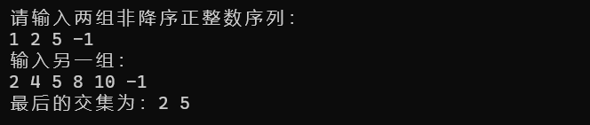
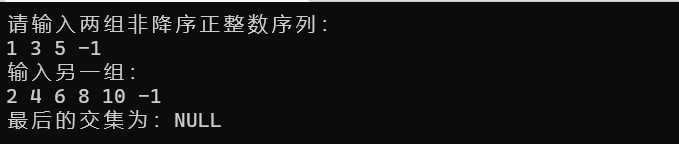
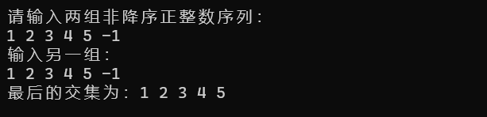
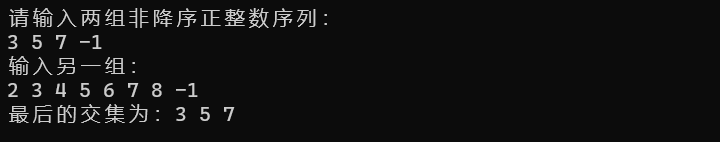
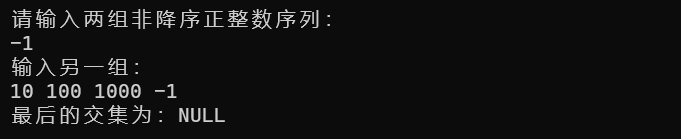
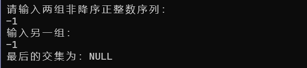
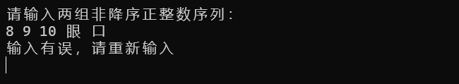
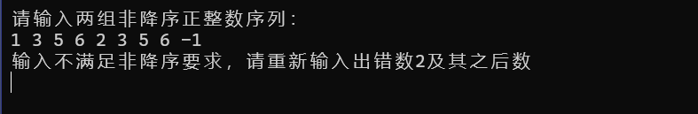

[toc]

# 1 分析

## 1.1 背景分析

求解集合的交集是一个很经典的数学问题，而在日常生活中，我们也经常遇到需要求解交集的问题，本题要求给出两个集合，用链表存储，求解其交集，便是求交集问题的抽象解法。

## 1.2 功能分析

本题求解交集，需要使用链表来存储数据，故需要链表能够增加数据，同时给出的交集在原有集合的基础上做删除，故链表也需要有删除功能。且需要有一个函数来读取用户输入的数据并进行错误处理，还需有一个函数来讲这些数据加入到链表之中，并判断是否是非降序输入，若不是，则要给出提示，重新输入。

# 2 设计

## 2.1 数据结构设计

本题使用链表存储数据，并且链表只要具备基本的增删操作即可，同时可以重载链表的<<运算符，方便输出结果。

## 2.2 类结构设计

本题只需要链表类以及链表节点类，链表类中包含一个私有成员first指针，指向链表的第一个元素，以及链表的增删等公有操作，链表节点类存储该节点元素以及指向下一节点的指针。

## 2.3 操作设计

### 2.3.1 链表节点类

``` cpp
template<class T>
class listNode
{
public:
	T val;    //节点数据
	listNode<T>* next;  //下一节点
};
```

### 2.3.2 链表类

``` cpp
template<class T>
class list :public listNode<T>
{
	//重载输入输出运算符
	template <class S>
	friend ostream& operator<<(ostream& out, list<S> x);
	template <class Q>
	friend istream& operator>>(istream& in, list<Q>& x);
private:
	listNode<T>* first;
public:
	list();       //构造函数
	~list();      //析构函数
	bool empty() const;   //链表是否为空
	int getLength()const;  //获取链表长度
	listNode<T>* find(T elem);   //找到指定元素
	bool insert(int i, T& elem);    //插入指定位置元素
	bool remove(int i, T& elem);    //删除指定位置元素
	bool pushBack(T& elem);    //在末尾加入元素
	void display() const;      //输出链表
	listNode<T>* getFirst() { return first; };    //返回首个节点
};
```

## 2.4 系统设计

问题开始，首先给出提示，要求用户输入两组正整数非降序序列，然后进入到listInput()函数中，输入链表，在该函数中调用numInput()函数输入每一个数，并作错误处理，输入数字完成后在listInput()函数中与上次输入的数字比较，判断是否是非降序序列，若不是，则给出提示并要求重新输入，之后在main函数中完成求链表交集的运算，并将结果在list1中表示出来。

# 3 实现

## 3.1 链表pushBack()函数实现

在链表末尾加入元素，只要new一个新的链表节点，将其link域置空，若链表不空，将链表尾节点的link域指向新的链表节点，若为空链表，将first置为新节点的地址。

``` cpp
template<class T>
bool list<T>::pushBack(T& elem)    //在末尾添加元素
{
	listNode<T>* newNode = new listNode<T>;     
	if (!newNode)
	{
		cerr << "Error allocating memory!" << endl;
		return false;
	}

	listNode<T>* tmp = first;
	if (tmp)                   //如果头节点不空
	{
		while (tmp->next)
			tmp = tmp->next;
		tmp->next = newNode;
		newNode->next = nullptr;
		newNode->val = elem;
	}
	else      //链表为空则将first置为新节点的地址
	{
		first = newNode;
		first->next = nullptr;
		first->val = elem;
	}
	return true;
}
```

## 3.2 非降序序列输入实现

### 3.2.1 单个数字输入实现

``` cpp
void numInput(int& n)
{
	while (1)
	{
		cin >> n;
		if (cin.fail())       //如果输入错误
		{
			cin.clear();     //改变输入状态
			cin.ignore(9999, '\n');    //清空缓冲区
			cerr << "输入有误，请重新输入" << endl;     //给出错误提示
		}
		else
			break;     //退出输入循环
	}
}
```

### 3.2.2 序列输入实现

用last保存上次输入的结果，并与这次输入的数字比较，若为降序，则给出错误提示，清空输入缓冲区，重新输入。

``` cpp
void listInput(list<int>& in)
{
	int n = 0, last = 0;
	while (1)
	{
		numInput(n);
		if (n <= 0)
			break;
		if (last > n)    //为降序
		{
			cerr << "输入不满足非降序要求，请重新输入出错数"<<n<<"及其之后数" << endl;
			cin.clear();
			cin.ignore(9999, '\n');     //清空缓冲区
			continue;
		}
		last = n;
		in.pushBack(n);
	}
}
```

## 3.3 求链表交集功能实现

求链表交集，为了节省空间，将交集结果直接在输入链表中表示。假设有两个输入链表a,b，结果在a中表示。需要三个指针，pa,pb,和pc。pa,pb分别指向a,b中正在比较的元素，pc直线pa指向元素的前一个，便于删除pa指向元素，比较过程，有以下三种情况：

- 若pa,pb所指元素相等，则说明为最后交集元素，三个指针都往后移动
- 若pa元素小于pb元素，由于是非降序序列，说明直到pb之后以及其自身都没有和pa相等的元素，pa元素不可能为交集元素，删除，且pa向后移动
- 若pa元素大于pb元素，由于是非降序序列，还不能确定b中是否没有元素与pa元素相等，pb向后移动

当pb或pa中有一个走到链表结尾时停止循环，并检查a中是否有剩下元素，将其全部删除。

``` cpp
	listNode<int>* pb = list2->getFirst();
	listNode<int>* pa = list1->getFirst();
	listNode<int>* pc = new listNode<int>();   //指向pa前一个指针，方便删除
	listNode<int>* tmp = pc;
	pc->next = pa;
	pc->val = 0;

	while (pa != nullptr && pb != nullptr) 
	{
		if (pa->val == pb->val)    //如果相等，保留
		{
			pa = pa->next;
			pb = pb->next;
			pc = pc->next;
		}
		else if (pa->val < pb->val)  //小于，将其删除
		{
			int elem = 0;
			if (pa == list1->getFirst())         //如果要删除的是头节点
			{
				list1->remove(1, elem);
				pa = list1->getFirst();
				pc->next = pa;
			}
			else
			{
				pc->next = pa->next;
				delete pa;
				pa = pc->next;
			}
		}
		else                      //大于，pb向后移动
			pb = pb->next;
	}
	while (pa != nullptr)         //将list1剩下的元素删除
	{
		int elem = 0;
		if (pa == list1->getFirst())      //如果要删除的是头节点
		{
			list1->remove(1, elem);
			pa = list1->getFirst();
			pc->next = pa;
		}
		else
		{
			pc->next = pa->next;
			delete pa;
			pa = pc->next;
		}
	}
	cout << "最后的交集为：";
	if (list1->getFirst())
		cout << *list1 << endl;
	else
		cout << "NULL" << endl;
```

# 4 测试

## 4.1 一般情况

- 输入数据：

  1 2 5 -1

  2 4 5 8 10 -1

- 预计输出：

  2 5

- 运行截图：

  

## 4.2 交集为空的情况

- 输入数据：

  1 3 5 -1

  2 4 6 8 10 -1

- 预计输出：

  NULL

- 运行截图：

  

## 4.3 完全相交的情况

- 输入数据：

  1 2 3 4 5 -1  

  1 2 3 4 5 -1  

- 预计输出：

  1 2 3 4 5

- 运行截图：

  

## 4.4 其中一个序列完全属于交集的情况

- 输入数据：

  3 5 7 -1

  2 3 4 5 6 7 8 -1

- 预计输出：

  3 5 7

- 运行截图：

  

## 4.5 其中一个序列为空的情况

- 输入数据：

  -1

  10 100 1000 -1

- 预计输出：

  NULL

- 运行截图：

  

## 4.6 两个序列均为空的情况

- 输入数据：

  -1

  -1

- 预计输出：

  NULL

- 运行截图：

  

## 4.7 输入非法字符的情况

- 预计输出：程序不崩溃，给出错误提示重新输入。

- 运行截图：

  

## 4.8 输入序列为升序的情况

- 预计输出：程序不崩溃，给出错误提示，并在首个升序处重新输入。

- 运行截图：

  